# Divided-Body SOI STL: 소자 하나로 "직렬 두 STL" 만들기

EE762 (KAIST, 2026 가을) 프로젝트 연구 기록 · Silvaco ATLAS 2D (device-only transient + MixedMode)

> **한 줄 요약 (2026-10-07)** · 결론은 [최종 결과](#최종-결과)
> SOI body를 n+ 섬으로 둘로 나누고, 섬을 저항(1e7 Ω)으로 접지하고, 섬 lifetime을 줄여 두 body를 분리했다.
> 그 결과 **drift-diffusion(DD) MixedMode 시뮬레이션에서 Id-Vd에 래치가 두 번(2.254 V, 3.296 V) 히스테리시스와 함께 나왔다.**
> 같은 소자를 에너지 균형 모델(hcte)로 계산하면 12가지 대책에도 3.6–5.3 V에서 전자 온도 폭주로 멈춰, hcte에서의 두 번째 래치는 확인하지 못했다 (Step 11). 지금은 DD로 설계 변수 split 43개를 돌리는 중이다 (Step 12).

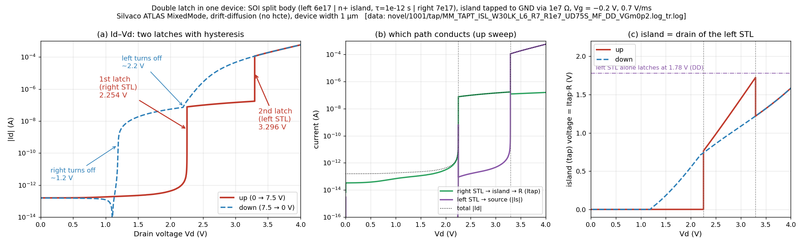
*그림 0. 최종 결과 (DD, MixedMode). 데이터: `1001/tap/MM_TAPT_ISL_W30LK_L6_R7_R1e7_UD75S_MF_DD_VGm0p2.log_tr.log` · 덱: `1001/tap/MM_TAPT_ISL_W30LK_L6_R7_R1e7_UD75S_MF_DD_VGm0p2.in` · 그린 코드: `1001/tap/fig/plot_double_latch.py`*

---

## 목차
- [읽는 법](#읽는-법)
- [저장소 구성](#저장소-구성)
- [공통 조건과 분석 도구](#공통-조건과-분석-도구)
- [전체 흐름 한눈에](#전체-흐름-한눈에)
- [Phase 0. 초기 split-body 실험 (08/27 – 09/08)](#phase-0-초기-split-body-실험-0827--0908)
- [Step 1. 도핑을 나누면 래치가 두 번 나올까? (09/21)](#step-1-도핑을-나누면-래치가-두-번-나올까-0921)
- [Step 2. 도핑 차이를 크게 (09/27)](#step-2-도핑-차이를-크게-0927)
- [Step 3. 왜 한 번뿐인가 → body를 물리적으로 나누기 (09/28)](#step-3-왜-한-번뿐인가--body를-물리적으로-나누기-0928)
- [Step 4. 다른 시도들 (09/28 – 10/01)](#step-4-다른-시도들-0928--1001)
- [Step 5. 섬을 저항으로 접지 (탭) (10/01 – 10/03)](#step-5-섬을-저항으로-접지-탭-1001--1003)
- [Step 6. 섬을 건너는 정공 막기 (10/03 – 10/04)](#step-6-섬을-건너는-정공-막기-1003--1004)
- [Step 7. 섬 전위 올리기: R 키우기 (10/04 – 10/06)](#step-7-섬-전위-올리기-r-키우기-1004--1006)
- [Step 8. 고전압 수치 폭주 (10/05 – 10/07)](#step-8-고전압-수치-폭주-1005--1007)
- [Step 9. 왼쪽 STL은 래치할 수 있나? → 단독 소자 (10/06)](#step-9-왼쪽-stl은-래치할-수-있나--단독-소자-1006)
- [Step 10. 본 소자: 래치 두 번 (10/07)](#step-10-본-소자-래치-두-번-1007)
- [Step 11. hcte로 확인 → 실패 기록 (10/05 – 10/07)](#step-11-hcte로-확인--실패-기록-1005--1007)
- [Step 12. DD split: 설계 변수별 데이터 (10/07 –, 진행 중)](#step-12-dd-split-설계-변수별-데이터-1007---진행-중)
- [Step 13. 왜 래치가 일어나나: .str로 원인 규명 (10/09)](#step-13-왜-래치가-일어나나-str로-원인-규명-1009)
- [최종 결과](#최종-결과)
- [트레이드오프 요약](#트레이드오프-요약)
- [현재 상태와 다음 단계](#현재-상태와-다음-단계)
- [부록: 핵심 데이터 파일](#부록-핵심-데이터-파일)
- [논문용 그림 (Fig. 1, Fig. 2)](#논문용-그림-fig-1-fig-2)

---

## 읽는 법

각 Step은 항상 같은 순서로 적었다.

| 기호 | 의미 |
|---|---|
| 🎯 **왜** | 이 구조/조건을 왜 만들었나 |
| 🛠 **어떻게** | 무엇을 바꿨나 (구조를 바꾼 경우 구조 그림 필수) |
| ⚠️ **문제** | 결과에서 무엇이 기대와 달랐나 |
| ✅ **해결** | 그래서 다음에 무엇을 바꿨나 → 다음 Step |

모든 그림 아래에 **데이터 출처**(이 저장소 기준 경로)와 **그린 코드**를 적었다. 그린 코드가 저장되지 않은 그림(작업 중 일회성 스크립트)은 그렇다고 명시했다.

---

## 저장소 구성

```
novel/
├── README.md                 ← 이 문서 (연구 기록)
├── tools/                    ← 필수 분석 코드 (log/str 읽기, 구조 그림)
├── docs/fig/                 ← README용 그림 (struct_*.png = 구조, prev/ = 1차 정리 그림)
├── *.in (루트), 0908/        ← Phase 0
├── 0921/ 0927/ 0927_bigsplit/ 0928/ 0929/ 1001/ 1001_ibody/   ← 날짜별 실험 (덱 .in, 표 .dat, 그림 .png)
└── 1001/tap/                 ← 탭 섬 구조 (이번 결과의 대부분), fig/ 에 그림
```

**올린 것**: 모든 덱(`.in`), 표(`.dat`), 그림(`.png`), 필수 코드(`.py` 6개), 핵심 log (부록 참고)
**안 올린 것**: `.str`(구조/해 스냅샷), `.out`(solver 출력), 나머지 `.log`, MixedMode 스냅샷(`*_tr_N`). 합계 약 5.4 GB로, 연구 서버 `/home/ysseo/novel/` 에 같은 경로로 남아 있다.
100 MB가 넘는 log 2개는 핵심 열만 뽑은 `*_extract.dat` 로 대신 올렸다.

---

## 공통 조건과 분석 도구

### 기준 소자 (Step 1 이후 공통)
| 항목 | 값 |
|---|---|
| Lg / S·D 길이 / 폭 | 0.30 µm / 0.50 µm / 0.5 µm (mesh width) |
| Tsi / gate oxide / BOX | 50 nm / 20 nm / 200 nm |
| S/D, gate | n+ 1e20, n+ poly 1e21 |
| 모델 | `bgn hcte consrh conmob fldmob fermi trap.tunnel bbt.std`, `impact selb length.rel` |
| solver | `method block newton climit=100 itlimit=200 NBLOCKIT=200 trap maxtraps=10` |
| bias | VG = −0.2 V, VD sweep (Step 5부터 transient ramp 0.7 V/ms) |

DD(drift-diffusion)라고 적힌 run은 위 모델에서 `hcte`만 뺀 것이다.

### 분석 도구 (`tools/`, 그 외 필수 코드)
| 파일 | 역할 |
|---|---|
| `tools/plog.py` | ATLAS `.log` / MixedMode `.log_tr.log` → numpy 배열. **열 번호 규칙이 docstring에 있다** |
| `0927/ebd/strcut.py` | `.str` 에서 Si 노드의 Ec, Ev, Efp, ψ, p, n 읽기 + 가로 cutline |
| `1001/tap/fig/strfig.py` | `.str` 스냅샷 → EBD(y = 25 nm) 그림, Si 막 2D 지도(정공·전위) |
| `tools/strstruct.py` | `.str` → 구조 그림(영역 + net doping). `docs/fig/struct_*.png` 생성 |
| `tools/make_struct_figs.py` | 이 문서의 구조 그림 전부를 다시 그림 |
| `1001/tap/fig/plot_double_latch.py` | 그림 0 재생성 |

```python
# 예: transient log에서 Id-Vd 꺼내기   (출처: tools/plog.py 의 열 규칙)
import sys; sys.path.insert(0, 'tools'); from plog import load
d = load('1001/tap/TAPT_ISL_W30LK_L3_R7_R1e6_UD7S_VGm0p2.log'); o = 1
Vd, Id, Is, Itap = d[:, o+11], d[:, o+12], d[:, o+7], d[:, o+17]
```

---

## 전체 흐름 한눈에

| Step | 구조/조건 변경 | 결과 | 다음으로 간 이유 |
|---|---|---|---|
| 1 | 도핑 split (소농도차), 산화막 notch | 래치 1번 | 차이가 너무 작은가? |
| 2 | 도핑 split (대농도차, 방향) | 래치 1번 (창은 조절 가능) | body가 전기적으로 하나 |
| 3 | Tsi split, **n+ 섬** | 래치 1번 (좌·우 동시) | 직렬이라 함께 켜짐 |
| 4 | split gate, n+/n−/p/n+, body 전류 추출 | 래치 1번 | — |
| 5 | **섬을 R로 접지 (탭)**, transient ramp | 여전히 동시 | 정공이 섬을 건넘 |
| 6 | 섬 폭 100 nm / 윗면 contact / **섬 lifetime 감소** | lifetime 감소만 분리 성공 | 왼쪽이 구동 안 됨 |
| 7 | **R 증가** (1e4 → 1e6 Ω) | 섬 전위 상승 | 5.3 V에서 계산 중단 |
| 8 | solver, 격자, hcte 제거 시도 | 원인 = 오른쪽 STL 전압 | 큰 R 필요 |
| 9 | **왼쪽 STL 단독 소자**, 도핑 탐색 | 3e17은 래치 불가, **6e17 래치** | 본 소자에 적용 |
| 10 | 왼쪽 6e17 + **R 1e7 Ω**, MixedMode | **DD에서 래치 2번** | hcte로 확인 필요 |
| 11 | 같은 소자를 hcte로 (12가지 수렴 대책) | 모두 3.6–5.3 V에서 중단 | hcte 접고 DD로 |
| 12 | DD split 69개 (R, 도핑, Vg, lifetime, 섬 폭·위치, Tsi, ramp, 꺼짐 급격화 + 그 위의 재조절) | 50개 완료, 19개 진행 중 | 설계 지도 |
| 13 | 래치 원인 규명 (.str 정공 수지) | 되먹임 = impact 정공 vs 재결합 | 분리된 두 사각형 다듬기 |

---

## Phase 0. 초기 split-body 실험 (08/27 – 09/08)

> 이 단계는 덱 머리말 기준으로만 요약한다 (결과 분석 그림은 이 저장소에 없음).

🎯 **왜** 한 소자의 body 도핑을 좌/우(P / P+)로 나누면 래치 특성을 설계할 수 있는지 보려고.
🛠 **어떻게** `ver1.in` – `ver3_*.in`(루트): Lg 0.6 µm, P / P+ split body FDSOI. `0908/`: Lim (2026) 논문 치수 재현(`limref_*`), split 위치 sweep(`sw_*`), back-gate / BBT / body 전류 싱크 / floating-body 평형 시간(`tau_*`), cycle 간 차이 원인(`ver4_*`), 래치 창 닫기(`win_*`).
⚠️ **문제** 기생 BJT 이득이 커서 래치 창이 잘 닫히지 않고(VLD 0.2 V대), cycle마다 결과가 달라지는 등 기준 소자 자체가 불안정했다.
✅ **해결** 09/21부터 기준 소자를 Lg 0.3 µm, Tsi 50 nm, 균일 5e17 STL로 다시 잡고 거기서 출발.

| 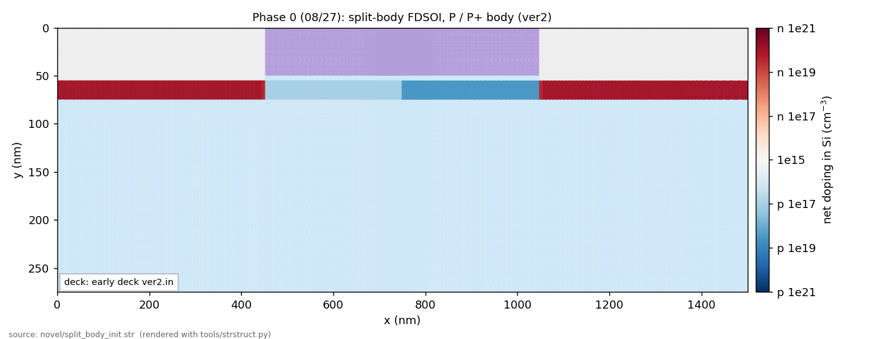 | 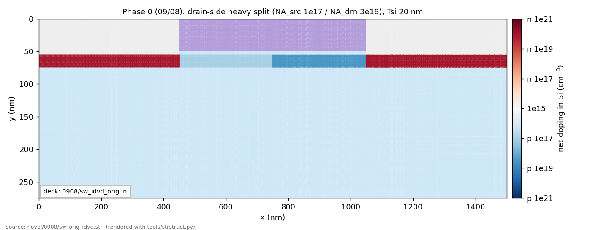 |
|---|---|
| 출처: `split_body_init.str` (덱 `ver2.in`) | 출처: `0908/sw_orig_idvd.str` (덱 `0908/sw_idvd_orig.in`) |

*구조 그림 코드: `tools/make_struct_figs.py` → `tools/strstruct.py`*

---

## Step 1. 도핑을 나누면 래치가 두 번 나올까? (09/21)

🎯 **왜** body 왼쪽/오른쪽 도핑이 다르면 두 영역의 래치 전압이 달라서, Id-Vd에 래치가 두 번 나올 것이라고 기대했다.

🛠 **어떻게**
- 기준: 균일 5e17 STL (`0921/STL_NB5p0_localfine.in`)
- 소농도차 split: L/R = 4.8–5.4e17, split 위치 Lg의 40/50/60 % (`0921/SPLIT_*.in`)
- 아래쪽에 산화막 notch를 넣어 두 body를 떼고 위쪽 얇은 Si bridge로만 연결 (`0921/B*_W*_L*_R*.in`)

|  |  |  |
|---|---|---|
| 기준 STL · `0921/STL_NB5p0_localfine_END.str` | 소농도차 · `0921/SPLIT_L5p0_R5p2_X50_END.str` | notch + bridge · `0921/B10_W20_L5p0_R5p2_END.str` |

⚠️ **문제** 모두 **래치 1번**. 소농도차는 균일 소자(V_LU 3.85 / V_LD 3.50 V)와 ±0.15 V 이내로 같았다. notch 소자도 단일 래치(V_LU 4.27–4.44 V).

| 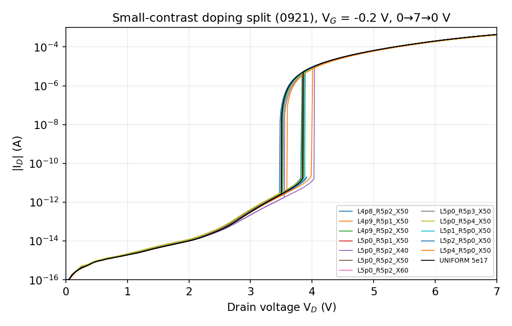 | 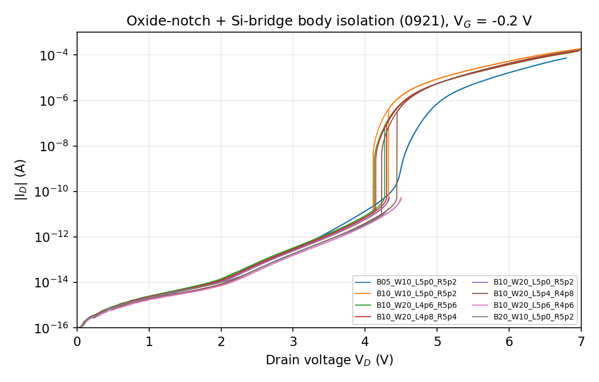 |
|---|---|
| 데이터: `0921/SPLIT_*.log`, `0921/STL_NB5p0_localfine.log` | 데이터: `0921/B*_W*_L*_R*.log` |

*그린 코드: 1차 정리 때의 일회성 스크립트 (저장 안 됨)*

✅ **해결** 도핑 차이가 4–12 %로 너무 작아서일 수 있다 → Step 2에서 차이를 2–10배로 키운다.

---

## Step 2. 도핑 차이를 크게 (09/27)

🎯 **왜** 도핑 차이를 크게 하면 두 영역의 래치 전압이 확실히 갈라질 것.

🛠 **어떻게** 평균 약 5e17을 유지하면서 L/R 비율 2.3 / 4 / 10배, 고도핑을 drain 쪽 또는 source 쪽에 둔다 (`0927/BIG_*_X50.in`, `0927_bigsplit/BIG_*_X50.in`). 전이 전후 `.str`을 저장해 EBD를 그렸다.

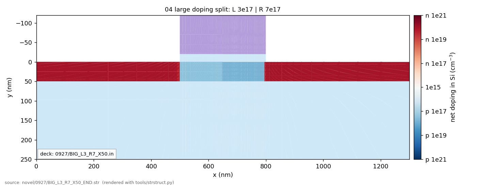
*출처: `0927/BIG_L3_R7_X50_END.str` (덱 `0927/BIG_L3_R7_X50.in`)*

⚠️ **문제** **여전히 래치 1번.** 대신 방향과 비율로 래치 창은 조절된다.

| 케이스 | V_LU (V) | V_LD (V) | 창 (V) |
|---|---|---|---|
| L3_R7 (drain 쪽 고도핑 2.3×) | 3.67 | 3.32 | 0.35 |
| L7_R3 (source 쪽 2.3×) | 4.89 | 3.88 | 1.01 |
| L8_R2 (source 쪽 4×) | 5.76 | 4.11 | 1.66 |

| 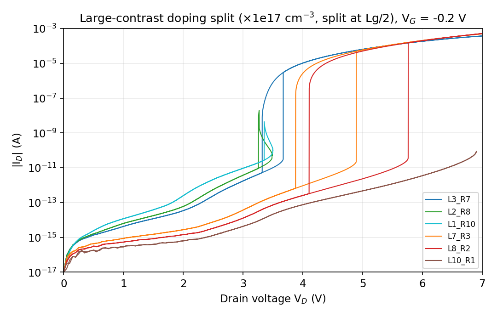 | 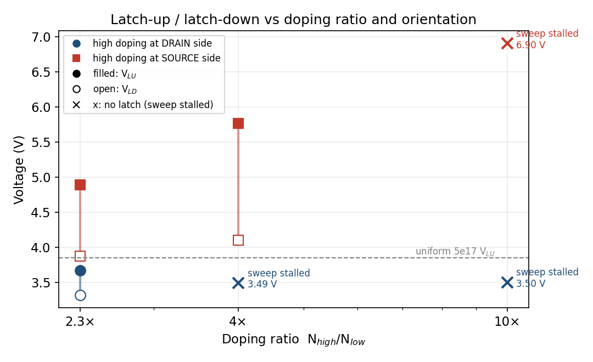 |
|---|---|
| 데이터: `0927/BIG_*_X50.log`, `0927_bigsplit/BIG_*_X50.log` | 데이터: 같은 log + `0921/STL_NB5p0_localfine.log` |

EBD를 보면 원인이 보인다. 정공 준페르미 준위(Efp, 점선)가 **body 전체에서 하나로 이어져** 있어서 왼쪽/오른쪽 body 전위가 따로 움직일 수 없다.

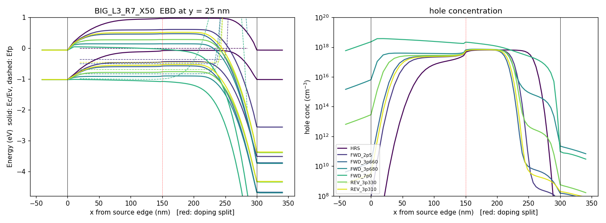
*데이터: `0927/BIG_L3_R7_X50_{HRS,FWD_*,REV_*}.str` · 그린 코드: `0927/ebd/strcut.py` (+ 일회성 `ebd_plot.py`)*

✅ **해결** 래치가 한 번인 이유 세 가지:
1. **Efp 연속**: p / p+ 계단은 다수 캐리어(정공)를 막지 못한다.
2. **저농도 쪽 공핍**: 저농도 body가 drain 쪽이면 공핍되어 정공 저장소가 하나만 남는다.
3. (다음 Step에서 확인) 물리적으로 나눠도 직렬이면 함께 켜진다.

→ body를 **물리적으로** 나눠야 한다 (Step 3).

> 참고: 이 Step부터 S자 I-V(NDR)에서 전압 sweep이 멈추는 문제가 보였다 (L2_R8, L1_R10이 3.49–3.50 V에서 정지). Step 5에서 transient ramp로 해결.

---

## Step 3. 왜 한 번뿐인가 → body를 물리적으로 나누기 (09/28)

🎯 **왜** 정공이 두 body 사이를 자유롭게 오가지 못하게 하면 두 body가 따로 래치할 것.

🛠 **어떻게**
- Tsi split: 왼쪽 20 nm / 오른쪽 50 nm (`0928/TSI_*.in`)
- **n+ 섬**: 채널 가운데 30 nm, 1e20, Tsi 전체 → 왼쪽 STL(source–섬)과 오른쪽 STL(섬–drain)이 직렬 (`0928/ISL_W30_*.in`)

| 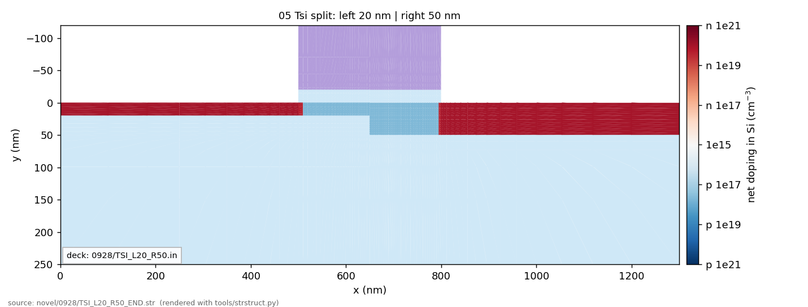 | 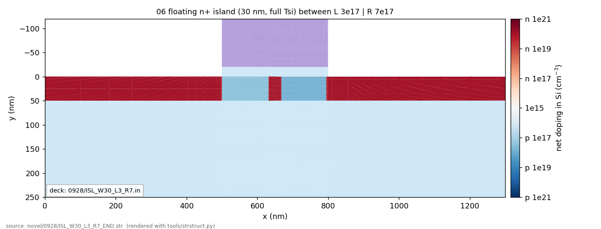 |
|---|---|
| `0928/TSI_L20_R50_END.str` | `0928/ISL_W30_L3_R7_END.str` |

⚠️ **문제** n+ 섬은 body를 **분리하는 데는 성공**했다(래치 전 좌/우 body 전위 −0.02 V vs 0.36 V). 하지만 **3.26 V에서 좌·우·섬이 동시에 점프**해서 여전히 래치 1번.

| 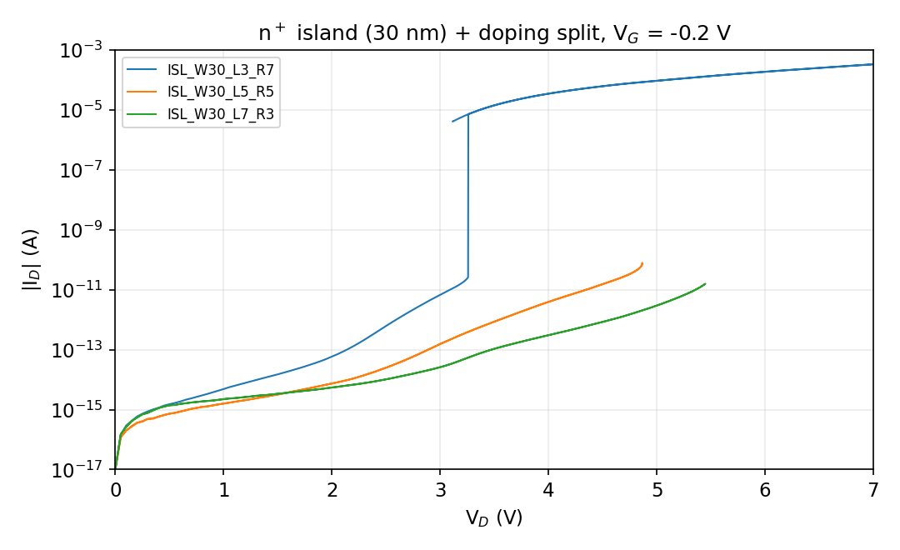 | 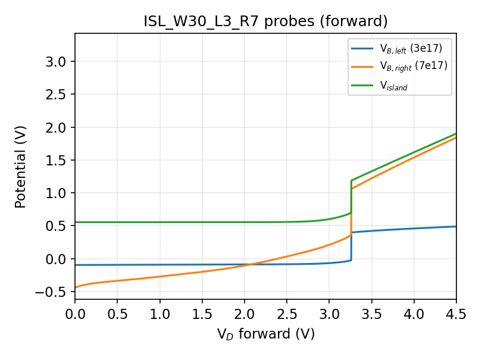 |
|---|---|
| 데이터: `0928/ISL_W30_{L3_R7,L5_R5,L7_R3}.log` | 데이터: `0928/ISL_W30_L3_R7.log` (probe VB_left, VB_right, V_island) |

✅ **해결** 원인은 **직렬 제약**이다. 섬이 떠 있으면 오른쪽 STL 전류는 반드시 왼쪽 STL을 통과해야 해서, 한쪽만 켜질 수 없다. → 섬에 따로 빠져나갈 길을 만들어야 한다 (Step 5).

<details><summary>같은 시기의 Id-Vg 결과 (부수 결과)</summary>

drain 쪽 고도핑(L3_R7)만 Vg 방향 래치가 있었다 (up 1.390 / down 1.335 V, SS 36 mV/dec).

| 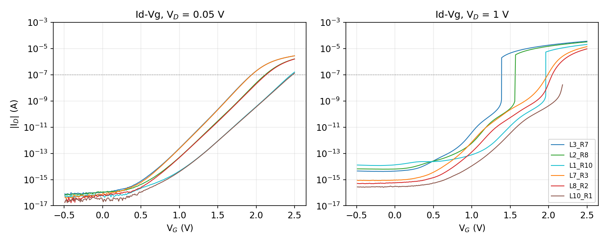 | 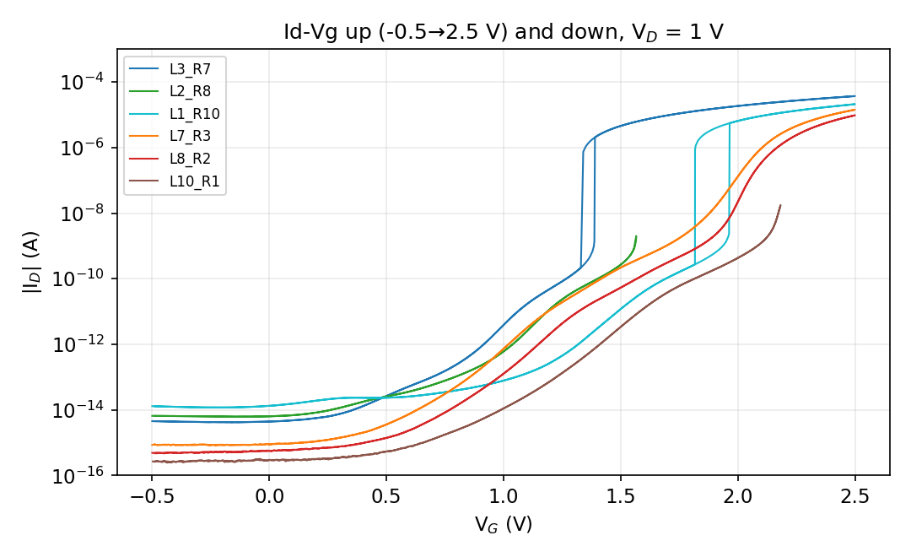 |
|---|---|
| 데이터: `0928/idvg/IDVG_BIG_*_X50_vd0p05.log`, `*_vd1.log` | 데이터: `0928/idvg_return/IDVGR_BIG_*_X50_vd1.log` |
</details>

---

## Step 4. 다른 시도들 (09/28 – 10/01)

🎯 **왜** 섬 이외의 방법으로도 두 body를 독립시킬 수 있는지 확인.

| 시도 | 구조 | 결과 |
|---|---|---|
| split gate (`0929/splitgate/SG_*.in`) | 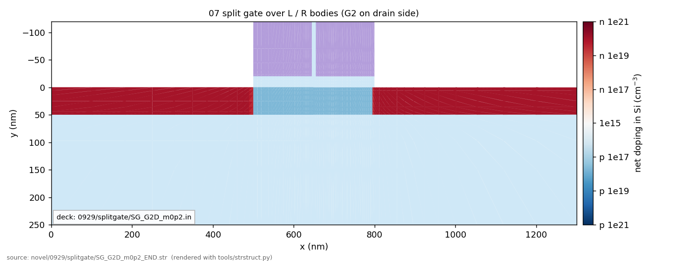 `0929/splitgate/SG_G2D_m0p2_END.str` | 래치 1번. 대신 G2 전압으로 **래치 창 0.36 → 1.18 V 조절** |
| n+ / n− / p / n+ (`1001/nnpn/NNPN_*.in`) | 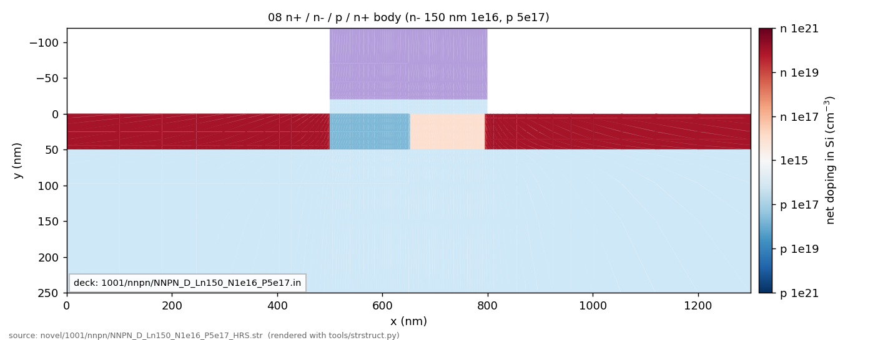 `1001/nnpn/NNPN_D_Ln150_N1e16_P5e17_HRS.str` | 래치 1번 |
| body 전류 추출 (`0928/idvg_ibody2/RB_*.in`) | BOX 관통 p neck + 직렬 저항 | 박막 SOI는 −12 V에서도 최대 약 2e-11 A만 추출 |
| integrate-and-fire / 기억 (`0929/burst`, `1001/memory`) | MixedMode, drain에 전류원 + C | bursting 없음, 단기 문턱 기억(~ms)만 |

| 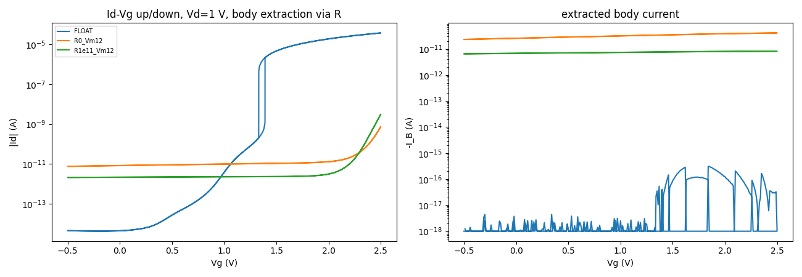 | 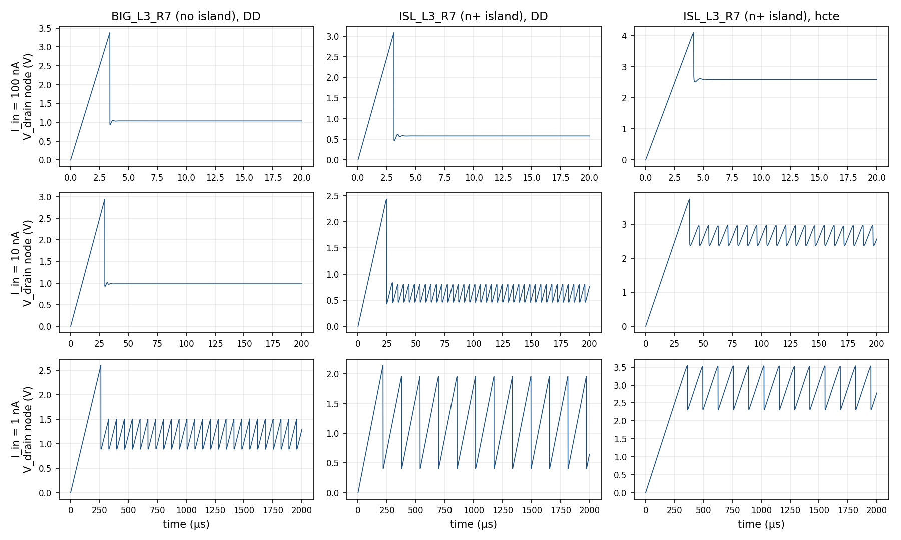 | 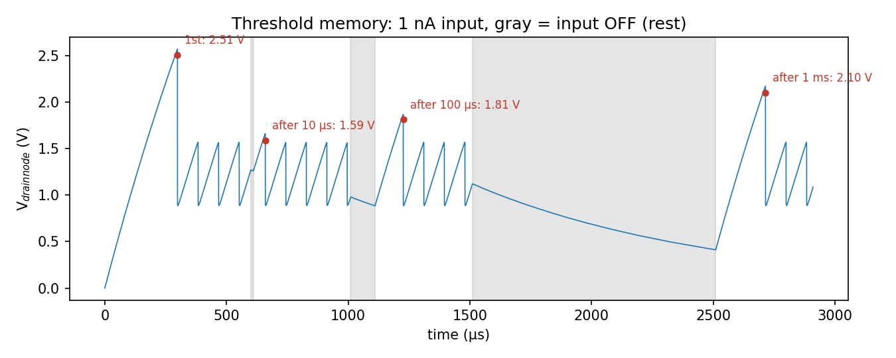 |
|---|---|---|
| `0928/idvg_ibody2/RB_BIG_L3_R7_*_vd1.log` | `0929/burst/BURST_*.log_tr.log` | `1001/memory/MEM_BIG_L3_R7_I1n.log_tr.log` |

✅ **해결** 래치 2번이 목표라면 n+ 섬 구조가 가장 가깝다 → 섬의 직렬 제약을 푸는 쪽으로 간다.

---

## Step 5. 섬을 저항으로 접지 (탭) (10/01 – 10/03)

🎯 **왜** 섬을 저항 R로 접지하면, 오른쪽 STL이 먼저 켜졌을 때 그 전류가 왼쪽을 거치지 않고 R로 빠진다. 섬 전위(= I·R)가 올라가면 그게 왼쪽 STL의 drain 전압이 되어 **두 번째 래치**를 일으킬 것.

🛠 **어떻게** 섬 아래 BOX를 n+ 기둥(neck)으로 관통시켜 바닥에 `tap` 전극을 두고 `contact name=tap resistance=…`로 R을 단다.

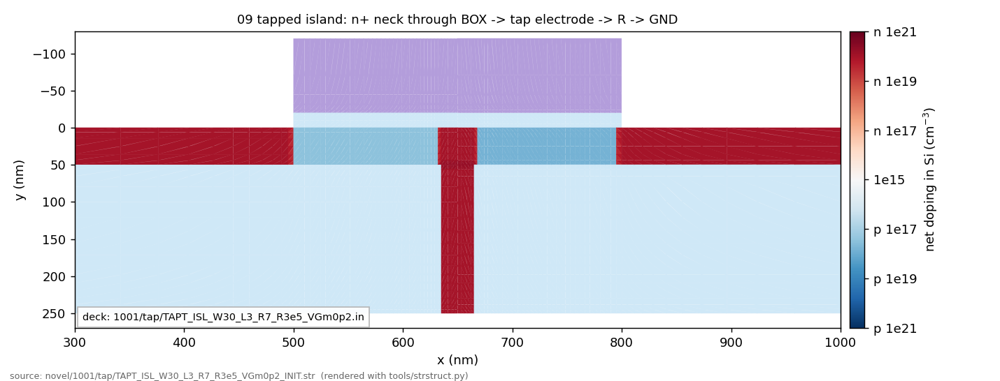
*출처: `1001/tap/TAPT_ISL_W30_L3_R7_R3e5_VGm0p2_INIT.str` (덱 `1001/tap/TAPT_ISL_W30_L3_R7_R3e5_VGm0p2.in`)*

```
# 출처: 1001/tap/TAPT_ISL_W30_L3_R7_R3e5_VGm0p2.in
region num=9  x.min=$XiL x.max=$XiR y.min=$tsi y.max=$Ybot silicon      # neck through BOX
electrode name=tap x.min=$XiL x.max=$XiR y.min=$Ybot y.max=$Ybot
doping uniform conc=1e20 n.type reg=9
contact name=tap resistance=300000                                      # 2D 단위 Ω·µm → 실제 R = 값 / 0.5 µm = 6e5 Ω
```

⚠️ **문제 1: 계산이 래치 직전에 멈춤.** S자 I-V의 fold에서 Newton이 수렴하지 못했다.

| 방법 | 결과 (R = 6e5 Ω) |
|---|---|
| 전압 sweep (`TAP_…_R3e5`) | 2.934 V, 1.65e-11 A에서 정지 |
| drain 직렬 1e5 Ω 추가 (`TAP_…_RD1e5`) | 효과 없음 (pA에서는 I·R ≈ 0) |
| 전류 sweep (`TAPI_…`) | 2.3e-15 A (0.69 V)에서 실패 |
| 전압 → 전류 제어 (`TAPS_…`) | 4.3e-11 A에서 정지 |
| **transient ramp 0.7 V/ms** (`TAPT_…`) | **0 → 7 → 0 V 완주** |

✅ **해결 1** `solve vdrain=X ramptime=… tstop=…`로 drain을 시간에 대해 ramp한다. 실제 시간 동역학이 불안정 가지를 건너가므로 점프와 히스테리시스가 바로 나온다. 이후 모든 run은 이 방식이다.

⚠️ **문제 2: 탭이 있어도 좌·우가 동시에 래치.** R을 60배 바꿔도 V_LU가 똑같다.

| R (실제) | V_LU | V_LD | 왼쪽(Is)도 점프? |
|---|---|---|---|
| 6e5 Ω | 2.990 | 2.289 | 예 |
| 6e4 Ω | 2.990 | 2.248 | 예 |
| 1e4 Ω | 2.990 | – | 예 |

| 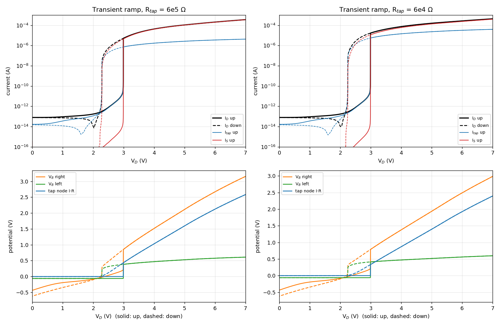 | 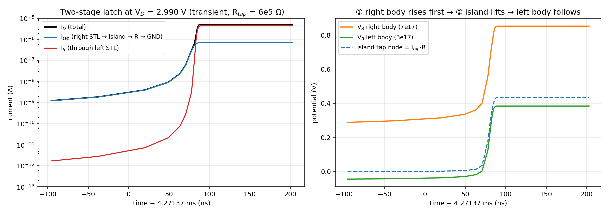 |
|---|---|
| 데이터: `1001/tap/TAPT_ISL_W30_L3_R7_{R3e5,R3e4}_VGm0p2.log` | 데이터: `1001/tap/TAPT_ISL_W30_L3_R7_R3e5_VGm0p2.log` (점프 부근 100 ns 확대) |

*그린 코드: 일회성 스크립트 (저장 안 됨)*

점프 순간을 확대하면 오른쪽 body가 먼저 오르고 약 10 ns 뒤 왼쪽이 따라온다. **한 번의 점프 안의 순서**일 뿐 두 단계 래치는 아니다.
원인: 오른쪽 p body / n+ 섬(30 nm) / 왼쪽 p body가 **가로 PNP**를 이룬다. 오른쪽에서 섬으로 들어간 정공이 얇은 섬을 재결합 없이 건너 왼쪽 body를 채운다.

✅ **해결 2** 정공이 섬을 못 건너게 해야 한다 (Step 6).

---

## Step 6. 섬을 건너는 정공 막기 (10/03 – 10/04)

🎯 **왜** 가로 PNP 결합을 끊으면 오른쪽 STL만 혼자 래치할 것.

🛠 **어떻게** 세 가지를 비교 (모두 R = 1e4 Ω, VG = −0.2 V)

| W100: 섬 폭 30 → 100 nm | C: 섬 윗면 ohmic contact로 탭 | B: 섬 + neck lifetime 1e-12 s |
|---|---|---|
| 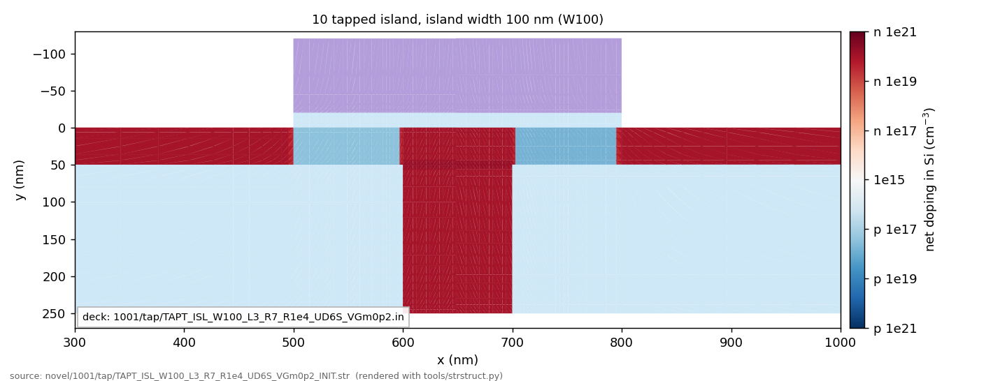 | 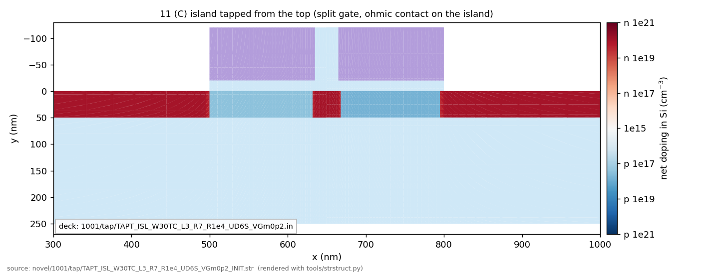 |  |
| `1001/tap/TAPT_ISL_W100_L3_R7_R1e4_UD6S_VGm0p2_INIT.str` | `1001/tap/TAPT_ISL_W30TC_L3_R7_R1e4_UD6S_VGm0p2_INIT.str` | `1001/tap/TAPT_ISL_W30LK_L3_R7_R1e4_UD6S_VGm0p2_INIT.str` |

```
# B 구조: 출처 1001/tap/TAPT_ISL_W30LK_L3_R7_R1e4_UD6S_VGm0p2.in
region num=10 x.min=$XiL x.max=$XiR y.min=0 y.max=$tsi silicon     # island as its own region
material region=10 taun0=1e-12 taup0=1e-12
material region=9  taun0=1e-12 taup0=1e-12
```

| 구조 | V_LU / V_LD (V) | 왼쪽 STL |
|---|---|---|
| W100 | 1.656 / 1.648 | 서서히 켜짐 (정공이 100 nm 섬도 건넘) |
| C (윗면 contact) | 3.035 / 2.402 | 동시에 점프 (정공이 5 nm 깊이 contact 아래로 지나감) |
| **B (lifetime 감소)** | **3.058 / 2.997** | **꺼진 채 (Is ≤ 5.4e-10 A)** |

| 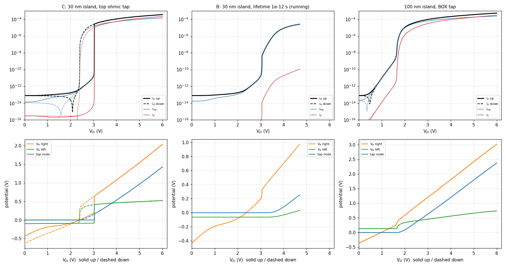 | 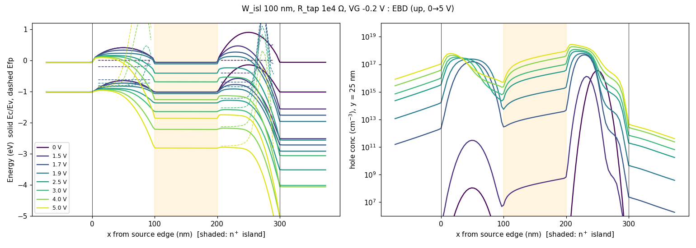 |
|---|---|
| 데이터: `1001/tap/TAPT_ISL_{W30TC,W30LK,W100}_L3_R7_R1e4_UD6S_VGm0p2.log` (B는 그림 당시 4.7 V까지) · 일회성 스크립트 | 데이터: `1001/tap/TAPT_ISL_W100_L3_R7_R1e4_UD6S_VGm0p2_UP_*.str` · 코드: `1001/tap/fig/strfig.py` |

B 구조 왕복(0 → 6 → 0 V)은 B 계열에서 **끝까지 완주한 유일한 결과**다. 같은 3.0 V에서 꺼진 상태(up)와 켜진 상태(down)가 공존하고(쌍안정), 왼쪽 body는 네 상태 모두 그대로다.

| 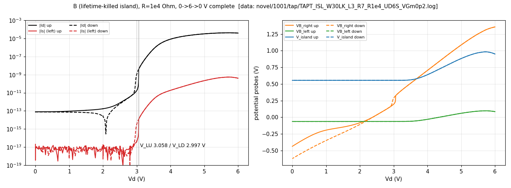 | 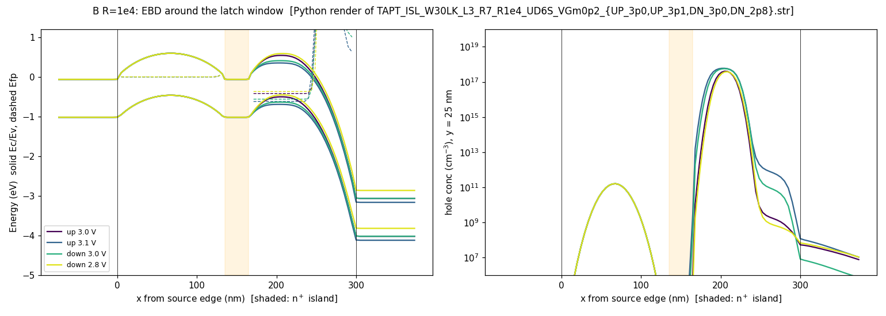 |
|---|---|
| 데이터: `1001/tap/TAPT_ISL_W30LK_L3_R7_R1e4_UD6S_VGm0p2_extract.dat` (원본 log 116 MB는 서버) | 데이터: `…_R1e4_UD6S_VGm0p2_{UP_3p0,UP_3p1,DN_3p0,DN_2p8}.str` · 코드: `strfig.py` |

⚠️ **문제** 분리는 됐지만 이번엔 **왼쪽이 아예 구동되지 않는다.** R = 1e4 Ω에서는 섬 전위가 +0.4 V 이상 오르지 못한다. 또 래치 창이 0.70 → 0.06 V로 좁아졌다 (원인 미확인, lifetime 감소와 관련 추정).

✅ **해결** **B 구조를 기본으로 채택**하고, 섬 전위를 올리기 위해 R을 키운다 (Step 7).

---

## Step 7. 섬 전위 올리기: R 키우기 (10/04 – 10/06)

🎯 **왜** 섬 전위 = I·R. R을 키우면 같은 전류로 섬 전위가 더 올라가서 왼쪽 STL을 구동할 것.

🛠 **어떻게** B 구조에서 R = 1e4 / 3e5 / 1e6 Ω (`1001/tap/TAPT_ISL_W30LK_L3_R7_{R1e4_UD6S,R3e5_UD7S,R1e6_UD7S}_VGm0p2.in`). 구조는 Step 6 B와 같다.

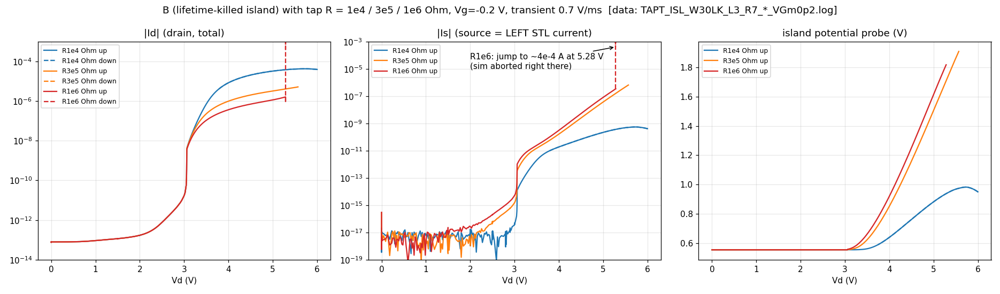
*데이터: `1001/tap/TAPT_ISL_W30LK_L3_R7_{R1e4_UD6S_extract.dat, R3e5_UD7S_extract.dat, R1e6_UD7S.log}` · 일회성 스크립트. R1e6의 5.28 V "점프"는 수치 오류다 (Step 8).*

| Vd = 4.98 V | R 1e4 | R 3e5 | R 1e6 |
|---|---|---|---|
| Id (오른쪽) | 3.2e-5 A | 3.2e-6 A | 1.1e-6 A |
| Is (왼쪽) | 2.1e-10 A | 3.3e-8 A | 7.3e-8 A |
| 섬 전위 상승 | +0.32 V | +0.94 V | +1.05 V |

⚠️ **문제** R을 키우자 섬 전위가 Vd 1 V당 약 0.73 V씩 오르고 왼쪽 Is도 지수적으로 커졌다. 그런데 **R1e6이 Vd = 5.284 V에서 계산 중단**됐다. 그 직전에 Id, Is가 음수로 튀었다.

✅ **해결** 그 점프가 진짜인지부터 확인 (Step 8).

---

## Step 8. 고전압 수치 폭주 (10/05 – 10/07)

🎯 **왜** 5.28 V 점프가 두 번째 래치인지, 수치 오류인지 판정해야 했다.

🛠 **어떻게** 마지막 log 점과 `.str`(전자 온도)을 진단했다.

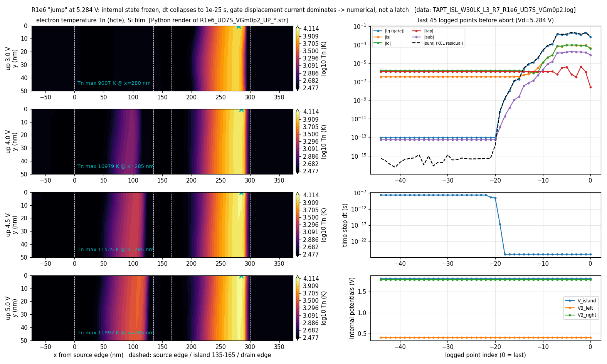
*데이터: `1001/tap/TAPT_ISL_W30LK_L3_R7_R1e6_UD7S_VGm0p2.log` (마지막 45점), `…_UP_{3p0,4p0,4p5,5p0}.str` · 일회성 스크립트*

| 진단 기준 | 정상 구간 | 마지막 20점 |
|---|---|---|
| time step | 2e-8 s | **1e-25 s** |
| 내부 전위 (섬, body) | 변함 | 소수점 3자리까지 고정 |
| gate 전류 | 1e-13 A | **1e-2 A** (변위전류) |
| KCL 잔차 | 1e-15 A | **1e-2 A** |

⚠️ **문제** **가짜 점프였다.** 오른쪽 STL drain 접합 표면의 전자 온도(hcte)가 12000 K를 넘으면서 time step이 붕괴했다. 이 문제를 풀려고 네 가지를 시도했다.

| 시도 | 덱 | 결과 |
|---|---|---|
| solver를 연립 Newton으로 (5.0 V `.str`에서 재시작) | `…_R1e6_RS50_NEWT_VGm0p2.in` | 원래 run과 5자리 일치, **같은 5.284 V에서 중단** |
| hcte 제거 후 4.5 V `.str`에서 재시작 | `…_R1e6_RS45_NOHC_VGm0p2.in` | 0.35 ns 만에 양쪽 래치 → **모델이 달라 이어지지 않음** (모델 섞기 금지) |
| drain 접합 격자 5 nm → 1 nm (MF) | `…_R1e6_UD7S_MF_VGm0p2.in` | 오른쪽 V_LU 3.058 → 2.989 V로 보정, **5.033 V에서 중단** |
| 왼쪽 6e17 (원래 격자) | `…_L6_R7_R1e6_UD75S_VGm0p2.in` | 5.20 V에서 중단 |

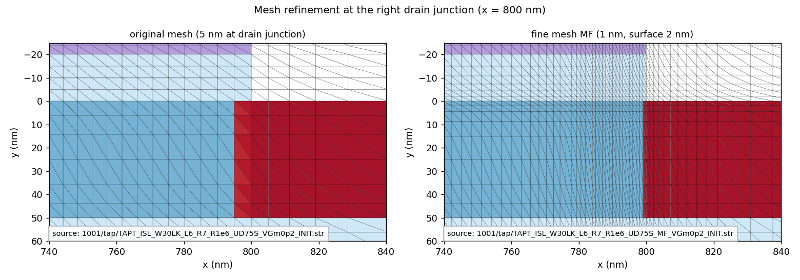
*격자 비교. 출처: `1001/tap/TAPT_ISL_W30LK_L6_R7_R1e6_UD75S{,_MF}_VGm0p2_INIT.str` · 코드: `tools/make_struct_figs.py`*

✅ **해결: 진짜 원인 찾기.** 멈춘 run을 모두 겹쳐 보니, **오른쪽 STL에 걸린 전압(Vd − 섬 전위)이 약 3.35–3.7 V에 들어가면 예외 없이 멈춘다.**
R = 1e6 Ω에서 왼쪽 래치에 필요한 섬 전위 +2.54 V를 만들려면 I = 2.5e-6 A가 필요하다. 그 전류에서 오른쪽 STL 전압은 3.6 V 이상이라, **R1e6으로는 원리적으로 두 번째 래치까지 계산할 수 없다.**
→ **R = 1e7 Ω**이면 I = 2.5e-7 A, 오른쪽 STL 전압 약 3.0 V로 안전 구간일 것이라고 보고 Step 10으로 갔다.
> **[10/07 정정]** 이 가설은 hcte에서 맞지 않았다. R = 1e7 Ω run도 오른쪽 STL 전압 약 3.05 V에서 같은 방식으로 멈췄다 (Step 11). 멈추는 조건은 "오른쪽 STL 전압" 하나가 아니라, **오른쪽 drain 접합 바로 앞(x ≈ 285 nm)의 전자 온도가 1만 K를 넘는 것**이다.

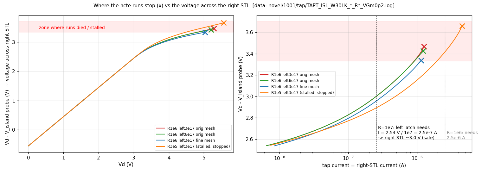
*데이터: `1001/tap/TAPT_ISL_W30LK_*_R*_VGm0p2.log` (R1e6 원래/MF/6e17, R3e5) · 일회성 스크립트*

---

## Step 9. 왼쪽 STL은 래치할 수 있나? → 단독 소자 (10/06)

🎯 **왜** Step 7에서 왼쪽(3e17) 전류는 점프 없이 매끄럽게 올랐다. 섬 전위가 충분해도 **왼쪽 STL 자체가 래치를 못 하는 도핑**일 수 있다. B 소자는 한 번에 하루가 걸리지만, 왼쪽만 떼어 낸 소자는 몇 분이면 판정할 수 있다.

🛠 **어떻게** 같은 격자·gate·모델에서 섬부터 오른쪽을 모두 n+ drain으로 바꾼다 → 단독 소자의 Vd = B 소자에서 필요한 섬 전위. 왼쪽 body 도핑만 바꿔 가며 탐색 (`1001/tap/LEFTONLY_L135_P*_*.in`).

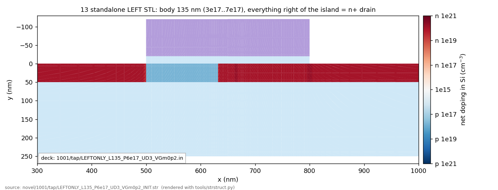
*출처: `1001/tap/LEFTONLY_L135_P6e17_UD3_VGm0p2_INIT.str`*

B 소자 안의 왼쪽 STL 전류가 단독 소자 곡선과 2–3배 이내로 겹쳐서, 단독 소자가 대표성이 있음을 먼저 확인했다.

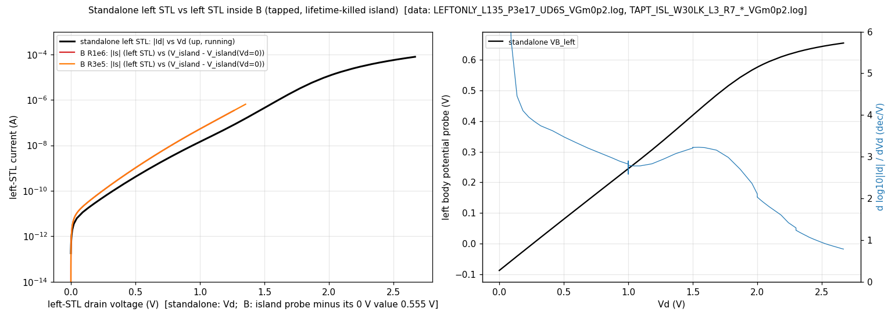
*데이터: `1001/tap/LEFTONLY_L135_P3e17_UD6S_VGm0p2.log`, `TAPT_ISL_W30LK_L3_R7_{R3e5,R1e6}_UD7S_VGm0p2` · 일회성 스크립트*

⚠️ **문제** **3e17·5e17은 래치하지 않고 연속적으로 켜진다.** 장벽이 낮아서(1 V에서 약 0.35 eV) 정공이 쌓였다가 한 번에 무너지지 않는다.

✅ **해결** 도핑을 올려 장벽을 세운다. 판정 기준은 **1 mV 구간 전류 상승 + time step 축소**로 정했다.

| 왼쪽 도핑 (hcte) | 1 mV 최대 상승 | V_LU |
|---|---|---|
| 3e17 | 연속 | – |
| 5e17 | 0.04 dec | – (연속) |
| **6e17** | **3.8 dec** | **2.539 V** |
| 7e17 | 5.1 dec | 3.002 V (= B 오른쪽 STL 3.06 V와 일치) |

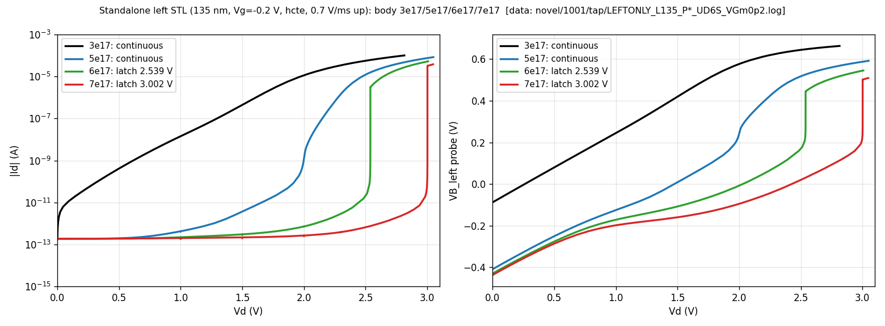
*데이터: `1001/tap/LEFTONLY_L135_P{3e17,5e17,6e17,7e17}_UD6S_VGm0p2.log` · 일회성 스크립트*

6e17은 0 → 3 → 0 V 왕복에서 **히스테리시스**가 있는 진짜 래치다 (켜짐 2.541 V, 꺼짐 2.48–2.32 V). 같은 2.4 V에서 꺼진 상태와 켜진 상태의 장벽 높이가 다르다.

| 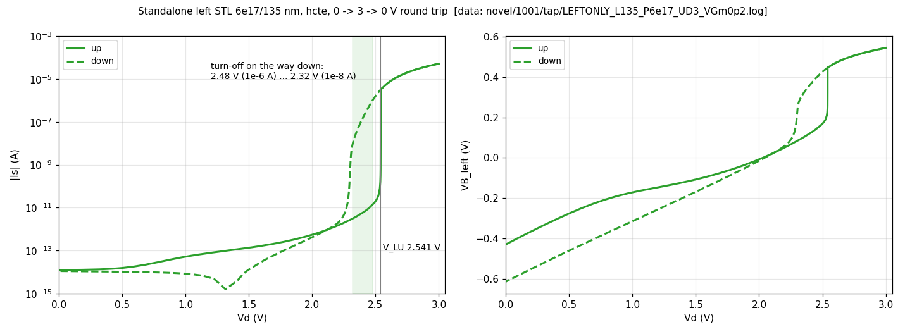 | 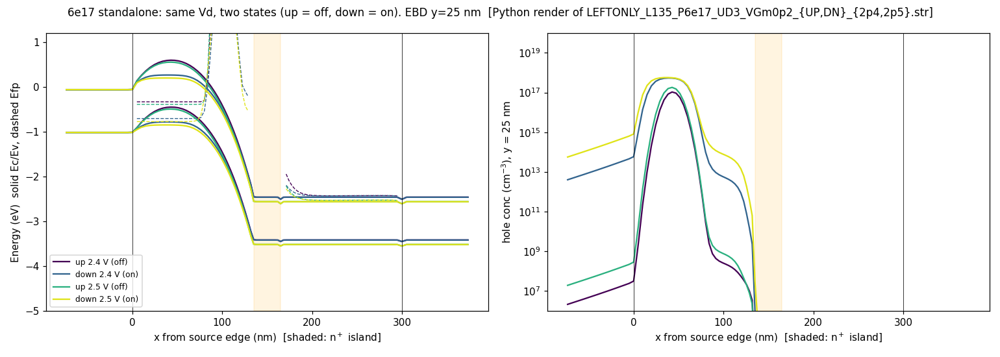 |
|---|---|
| 데이터: `1001/tap/LEFTONLY_L135_P6e17_UD3_VGm0p2.log` | 데이터: `…_P6e17_UD3_VGm0p2_{UP,DN}_{2p4,2p5}.str` · 코드: `strfig.py` |

조건 확인 두 가지:
- **ramp 속도**: 7 V/ms로 10배 빠르게 하면 V_LU가 2.645 V로 0.1 V 밀린다 (꺼짐은 같음) → 0.7 V/ms 유지 (`LEFTONLY_L135_P6e17_UD3_R7_VGm0p2.log`).
- **DD (hcte 없음)**: 래치 전압이 0.7–0.8 V 낮아진다 (5e17 1.218, 6e17 1.778, 7e17 2.235 V). 4e17(0.72 V), 5e17(1.22 V)처럼 밴드갭 근처나 그 아래에서도 래치가 나와서, **DD는 impact ionization을 과대평가**한다고 본다.

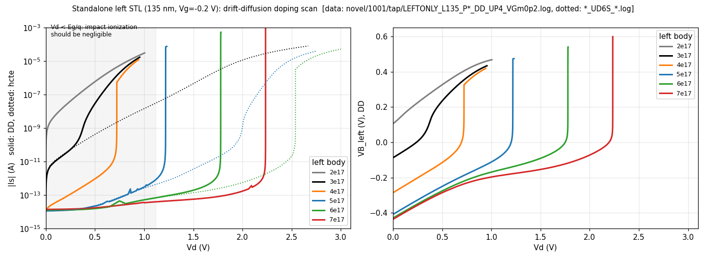
*데이터: `1001/tap/LEFTONLY_L135_P*_DD_UP4_VGm0p2.log` (실선), `*_UD6S_*.log` (점선) · 일회성 스크립트*

✅ **결론** 왼쪽 body = **6e17** (래치하는 최저 도핑).

---

## Step 10. 본 소자: 래치 두 번 (10/07)

🎯 **왜** 왼쪽 6e17 + 오른쪽 7e17 B 구조에, Step 8에서 정한 R = 1e7 Ω을 달면 두 번째 래치가 안전 구간 안에서 나올 것.

🛠 **어떻게**
- 구조: 왼쪽 6e17 | lifetime 감소 섬 + 탭 | 오른쪽 7e17, 고운 격자(MF)
- **MixedMode**: 구조와 VG = −0.2 V 상태를 `.str`로 만들고, 회로(drain 전압원, Rtap)에서 불러온다. 0 → 7.5 → 0 V, 0.7 V/ms.

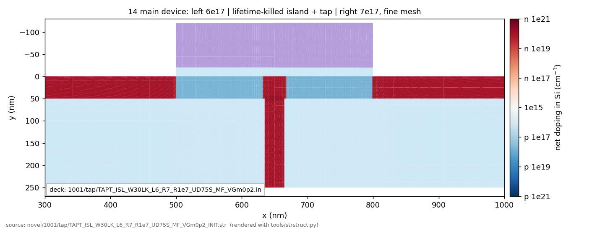
*출처: `1001/tap/TAPT_ISL_W30LK_L6_R7_R1e7_UD75S_MF_VGm0p2_INIT.str`*

```
# 출처: 1001/tap/MM_TAPT_ISL_W30LK_L6_R7_R1e7_UD75S_MF_DD_VGm0p2.in (MixedMode 부분)
.begin
Vdrain 1 0 pwl 0, 0, 1.071429e-02, 7.5, 2.142857e-02, 0
Vgate  2 0 -0.2
Rtap   3 0 1e7
Adev 1=drain 0=source 2=gate 3=tap 0=substrate infile=MM_TAPT_ISL_W30LK_L6_R7_R1e7_UD75S_MF_DD_VGm0p2_VG.str
.numeric lte=0.3 toltr=1e-5
.tran 1e-9 2.142857e-02
.end
```

⚠️ **문제 1: R이 크면 첫 번째 래치의 점프가 작아진다.** R이 오른쪽 STL 전류를 막기 때문이다 (R 1e4: 약 2자리 → R 1e6: 1.3자리). 다만 오른쪽 body 전위는 같이 뛰므로 래치는 있다.

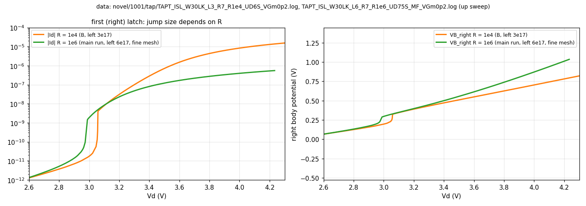
*데이터: `1001/tap/TAPT_ISL_W30LK_L3_R7_R1e4_UD6S_VGm0p2_extract.dat`, `TAPT_ISL_W30LK_L6_R7_R1e6_UD75S_MF_VGm0p2.log` · 일회성 스크립트*

⚠️ **문제 2: hcte 소자 단독 방식은 너무 느리다.** 4–5 V 구간 하나에 31,500 step(약 17시간)이 걸렸다. ramp를 빠르게 하면 V_LU가 밀려서(Step 9) 쓸 수 없다.

✅ **해결: MixedMode + DD로 먼저 확인** → 왕복 전체가 **42분**(1089 step)에 끝났고, **래치가 두 번 나왔다** (그림 0).

| 래치 | 켜짐 (up) | 꺼짐 (down) | 확인 |
|---|---|---|---|
| 1번째 (오른쪽) | **2.254 V** (Itap 1e-10 → 7e-8 A) | 약 1.2 V | DD 단독 7e17 V_LU 2.235 V와 일치 |
| 2번째 (왼쪽) | **3.296 V** (Is 1.8e-7 → 1.1e-4 A, 같은 Vd에서 2 ns) | 3.0 → 2.2 V | 점프 순간 섬 전압 1.72 V ≈ DD 단독 6e17 V_LU 1.778 V |

두 번째 점프가 수치 오류가 아님을 Step 8과 같은 기준으로 확인했다. 점프 동안 Vd 고정, time step 1–5e-10 s로 과정을 따라감, KCL 잔차 1e-15 A 이하, 점프 후 1.13e-4 A에서 안정, 직전 Is 기울기 증가(양의 되먹임).

| 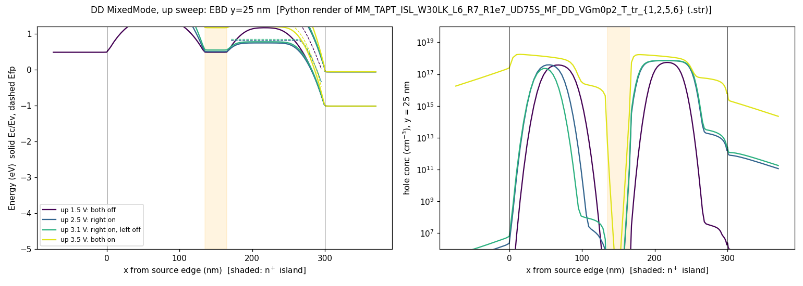 | 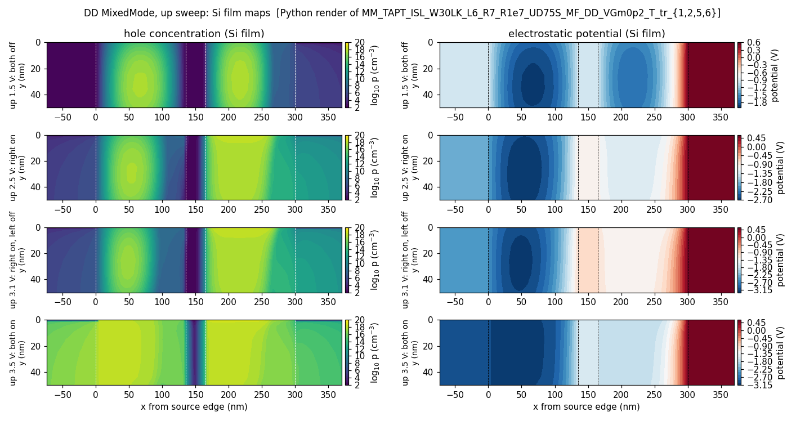 |
|---|---|
| 데이터: `1001/tap/MM_TAPT_…_DD_VGm0p2_T_tr_{1,2,5,6}` (MixedMode 스냅샷 = .str) · 코드: `strfig.py` | 같은 스냅샷, Si 막 정공·전위 지도 |

1.5 V: 둘 다 꺼짐 → 2.5 V: 오른쪽 body만 정공으로 참 → 3.1 V: 오른쪽만 켜짐 → 3.5 V: 양쪽 body 모두 1e18 cm⁻³.
(MixedMode 스냅샷은 저장 전위 기준이 달라 EBD의 밴드 절대 위치가 어긋나 있다. 정공 분포를 보면 된다.)

**한계**
1. DD 결과다. 래치 전압이 hcte보다 0.7–0.8 V 낮게 나오는 모델이다.
2. 이 MixedMode run은 소자 폭이 1 µm로 계산됐다 (저전압 전류가 소자 단독 방식의 정확히 2배). 따라서 R = 1e7 Ω은 0.5 µm 소자 기준 2e7 Ω에 해당한다.
3. 4 V 이상 전류(mA 단위)는 발열이 없는 DD라 비현실적이다.

---

## Step 11. hcte로 확인 → 실패 기록 (10/05 – 10/07)

🎯 **왜** Step 10의 래치 두 번은 DD 결과다. DD는 impact ionization을 과대평가하므로, 더 현실적인 에너지 균형 모델(hcte)에서도 나오는지 확인하려 했다.

🛠 **어떻게** 같은 소자를 hcte로 계산했다. 처음엔 소자 단독 방식, 나중엔 MixedMode(`Adev … width=0.5`)로 했다.

⚠️ **문제** **hcte run은 모두 두 번째 래치 전에 멈췄다.** 증상은 매번 같다:
`Warning: Updated temperatures exceeding limits` → time step이 1e-25 s까지 줄어듦 → `Cannot reduce time step`.
멈추는 위치는 항상 **오른쪽 STL의 drain 접합 표면(x ≈ 285 nm)**이고, 전자 온도가 1만 K를 넘었다.

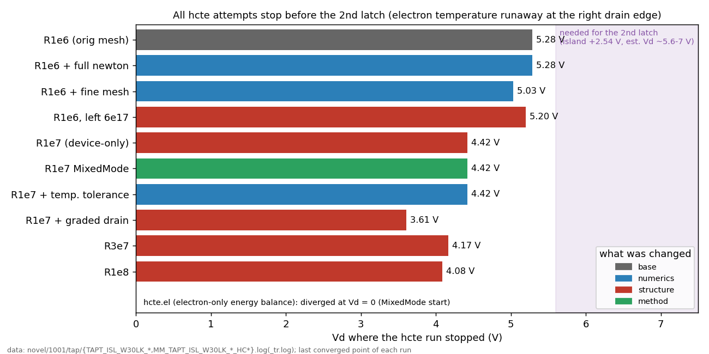
*데이터: 각 run의 마지막 수렴점. `1001/tap/TAPT_ISL_W30LK_*.log`, `1001/tap/MM_TAPT_ISL_W30LK_*_HC*.log_tr.log` · 코드: 일회성 스크립트 (`tools/plog.py`로 읽음)*

### 시도 기록 (수렴 실패 완화)

| # | 시도 | 분류 | 덱 (`1001/tap/`) | 결과 |
|---|---|---|---|---|
| 0 | 기준: R = 1e6 Ω, 왼쪽 3e17 | – | `TAPT_ISL_W30LK_L3_R7_R1e6_UD7S_VGm0p2.in` | 5.284 V에서 중단 (가짜 "점프", Step 8) |
| 1 | solver를 연립 Newton으로 (5.0 V `.str`에서 재시작) | 수치 | `…_R1e6_RS50_NEWT_VGm0p2.in` | 원래 run과 5자리 일치, **같은 5.284 V에서 중단** |
| 2 | time step 상한 `dt.max` 2e-8 s | 수치 | (1과 같은 덱) | 효과 없음 |
| 3 | hcte를 빼고 4.5 V `.str`에서 DD로 재시작 | 모델 | `…_R1e6_RS45_NOHC_VGm0p2.in` | 0.35 ns 만에 양쪽 래치 → **모델이 달라 이어지지 않음** (이후 모델 섞기 금지) |
| 4 | drain 접합 격자 5 nm → 1 nm, 표면 2 nm | 수치 | `…_R1e6_UD7S_MF_VGm0p2.in` | 래치 전압 2 % 보정, **5.033 V에서 중단** |
| 5 | 왼쪽 도핑 6e17 (원래 격자) | 구조 | `TAPT_ISL_W30LK_L6_R7_R1e6_UD75S_VGm0p2.in` | 5.201 V에서 중단 |
| 6 | R = 1e7 Ω ("오른쪽 STL 전압을 낮게" 가설) | 구조 | `…_L6_R7_R1e7_UD75S_MF_VGm0p2.in` | **4.422 V에서 중단** (가설 틀림) |
| 7 | MixedMode로 전환 | 계산 방식 | `MM_…_L6_R7_R1e7_UD75S_MF_HC_VGm0p2.in` | 결과 4자리 일치, **약 20배 빠름** (4시간 8분 → 11분). 같은 4.422 V에서 중단 |
| 8 | drain 경계를 Gaussian 경사로 (lat.char 10 nm) | 구조 | `MM_…_R1e7_…_HC_GD_VGm0p2.in` | **3.607 V**에서 중단 (더 나빠짐) |
| 9 | 전자 온도만 계산 `hcte.el` (block / 연립 newton) | 모델 | `MM_…_HCEL_VGm0p2.in`, `MM_…_HCEL_NW_VGm0p2.in` | **MixedMode 시작점(Vd = 0)부터 온도 발산** ("Unable to trap bias") |
| 10 | 온도 수렴 허용치 완화 (`tcx.tol` 1e-5 → 1e-3, `tcr.tol` 100 → 1e4) | 수치 | `MM_…_R1e7_…_HC_TOL_VGm0p2.in` | 같은 4.422 V에서 중단 |
| 11 | R = 3e7 Ω | 구조 | `MM_…_R3e7_UD75S_MF_HC_VGm0p2.in` | 4.167 V에서 중단 |
| 12 | R = 1e8 Ω | 구조 | `MM_…_R1e8_UD75S_MF_HC_VGm0p2.in` | 4.084 V에서 중단 |

| 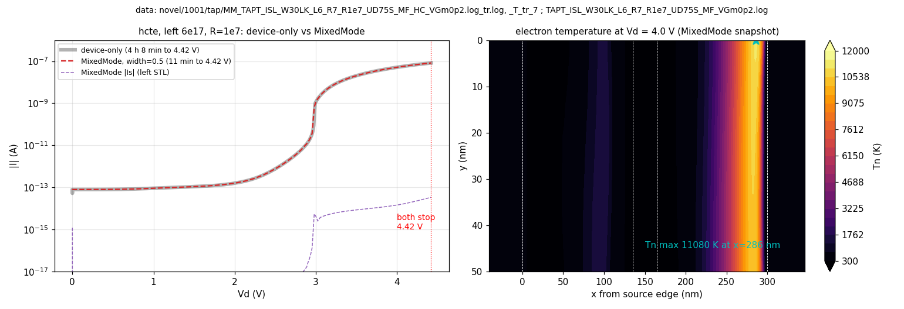 | 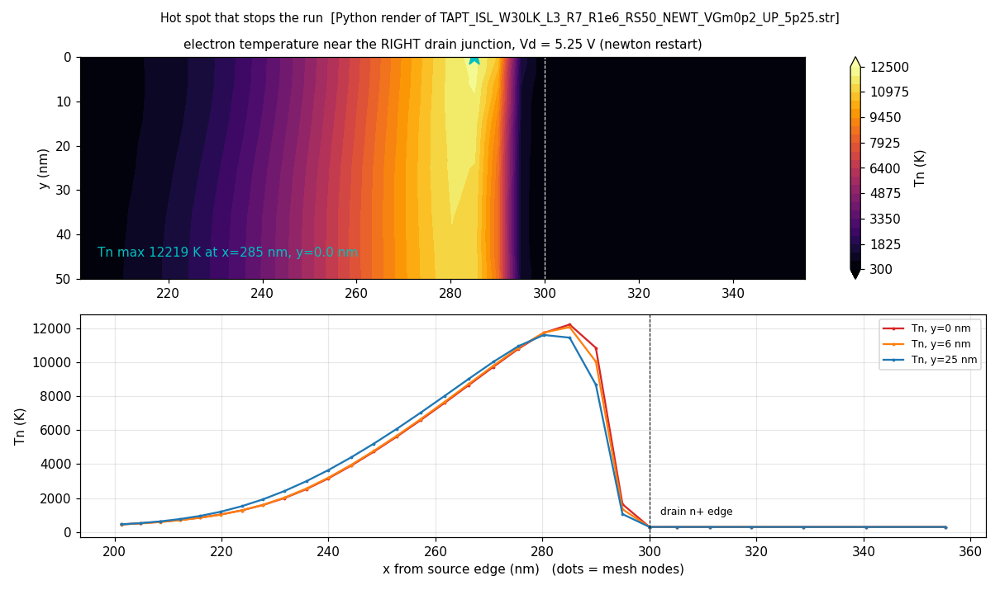 |
|---|---|
| 소자 단독 vs MixedMode (같은 결과, 20배 빠름) + 4.0 V 전자 온도. 데이터: `MM_…_R1e7_…_HC_VGm0p2.log_tr.log`, `…_T_tr_7`, `TAPT_…_L6_R7_R1e7_UD75S_MF_VGm0p2.log` · 일회성 스크립트 | 핫스팟: 12000 K → 300 K가 격자 2칸 안에서 떨어짐 (격자 세분화의 동기). 데이터: `…_R1e6_RS50_NEWT_VGm0p2_UP_5p25.str` · 일회성 스크립트 |

### 실패에서 알게 된 것
- **수치 설정(solver, time step, 격자, 허용치)으로는 멈추는 위치가 거의 안 바뀐다.** 수치 기법 문제라기보다 이 소자에서 hcte 해 자체가 불안정해지는 것으로 본다.
- **R을 키울수록 오히려 일찍 멈춘다** (1e6: 5.0–5.3 V → 1e7: 4.42 → 3e7: 4.17 → 1e8: 4.08 V). 섬 전위를 올리려면 R을 키워야 하는데, hcte 계산이 버티는 방향은 그 반대다. 두 번째 래치에는 Vd 약 5.6–7 V가 필요하다.
- drain 접합을 완만하게 하면 더 나빠졌다. 왜 그런지는 확인하지 못했다.
- 멈추는 Vd가 오른쪽 STL 전압 하나로 정해지지는 않는다 (Step 8 가설 정정).
- 얻은 것: **MixedMode(20배 빠름, 결과 동일)**, 정확한 고운 격자, 수치 오류 판정 기준(time step, KCL, 내부 상태, gate 변위전류).

✅ **결정** hcte 전체 소자 계산은 여기서 접는다. hcte로 확인된 것은 **각 STL 단독의 래치**(왼쪽 6e17 2.539 V 히스테리시스 포함, 오른쪽 7e17 3.002 V)와 **본 소자의 첫 번째 래치**까지다. 두 번째 래치를 포함한 동작은 DD로 넓게 조사한다 (Step 12).

---

## Step 12. DD split: 설계 변수별 데이터 (10/07 –, 진행 중)

🎯 **왜** DD에서 래치 두 번이 나오는 소자를 얻었으니, 어떤 설계 변수가 두 래치 전압·점프 크기·히스테리시스를 어떻게 바꾸는지 넓게 본다. 설계 지도를 만들기 위해서다.

🛠 **어떻게**
- 기준 덱(`1001/tap/MM_TAPT_ISL_W30LK_L6_R7_R1e7_UD75S_MF_DD_W05_VGm0p2.in`)에서 **한 번에 변수 하나만** 바꾼다.
- 덱은 [`1007_ddsplit/make_ddsplit.py`](1007_ddsplit/make_ddsplit.py)가 만든다 (`1007_ddsplit/DDS_*.in`).
- DD, MixedMode, `width=0.5`, 고운 격자, 0 → 6 → 0 V, 0.7 V/ms. 고정 Vd(올라갈 때 1.5–6 V, 내려올 때 5–0 V)마다 `.str` 스냅샷을 저장한다.
- 덱 하나에 30–40분, CPU 2개로 순서대로 돈다.

먼저 기준 덱의 소자 폭을 0.5 µm로 맞춰 다시 돌렸다. **래치 두 번이 그대로 나왔다** (2.2535 V / 3.3019 V; 1 µm일 때 2.254 / 3.296 V).

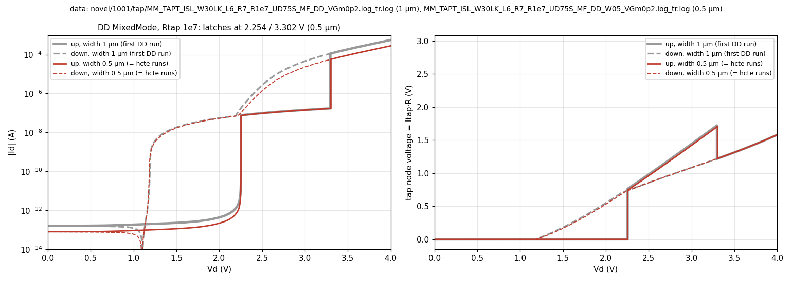
*데이터: `1001/tap/MM_TAPT_ISL_W30LK_L6_R7_R1e7_UD75S_MF_DD_VGm0p2.log_tr.log` (1 µm), `…_DD_W05_VGm0p2.log_tr.log` (0.5 µm) · 일회성 스크립트*

### 계획된 덱 (85개)

기준: 왼쪽 6e17 · 오른쪽 7e17 · R 1e7 Ω · Vg −0.2 V · 섬 30 nm, 중앙(Lg 50 %), lifetime 1e-12 s · Tsi 50 nm · 0.7 V/ms

| 변수 | 덱 (`1007_ddsplit/`) | 값 | 보려는 것 | 구조 변경 |
|---|---|---|---|---|
| 기준 | `DDS_BASE` | – | 같은 sweep(0–6–0 V)의 기준값 | |
| 탭 저항 R | `DDS_R3e5`, `DDS_R1e6`, `DDS_R3e6`, `DDS_R3e7`, `DDS_R1e8`, `DDS_R3e8` | 3e5 – 3e8 Ω | 첫 번째 점프 크기 vs 두 번째 래치 전압 | |
| 왼쪽 body 도핑 | `DDS_NL4e17`, `DDS_NL5e17`, `DDS_NL5p5e17`, `DDS_NL6p5e17`, `DDS_NL7e17`, `DDS_NL8e17` | 4e17 – 8e17 | 두 번째 래치 전압, 래치가 생기는 경계 | |
| 오른쪽 body 도핑 | `DDS_NR5e17`, `DDS_NR6e17`, `DDS_NR6p5e17`, `DDS_NR7p5e17`, `DDS_NR8e17`, `DDS_NR9e17`, `DDS_NR1e18` | 5e17 – 1e18 | 첫 번째 래치 전압, 래치 순서가 뒤바뀌는 지점 | |
| Vg | `DDS_VGm1p0`, `DDS_VGm0p5`, `DDS_VGm0p3`, `DDS_VGm0p1`, `DDS_VG0`, `DDS_VGp0p2` | −1.0 – +0.2 V | gate로 두 래치를 함께 조절할 수 있나 | |
| 섬 lifetime | `DDS_TAU1em13`, `DDS_TAU1em11`, `DDS_TAU1em10`, `DDS_TAU1em9` | 1e-13 – 1e-9 s | 두 body 분리가 깨지는 lifetime | |
| 섬 폭 | `DDS_WISL20`, `DDS_WISL50`, `DDS_WISL100` | 20, 50, 100 nm | 섬 폭과 결합, 래치 전압 | ✔ (`set Wisl`) |
| 섬 위치 | `DDS_XS40`, `DDS_XS60` | Lg의 40 %, 60 % | 왼쪽/오른쪽 body 길이 비 | ✔ (`set Xsplit`) |
| Si 두께 | `DDS_TSI30`, `DDS_TSI70` | 30, 70 nm | 막 두께 의존성 | ✔ (`set tsi`) |
| ramp 속도 | `DDS_RATE0p07`, `DDS_RATE7` | 0.07, 7 V/ms | DD에서의 ramp 의존성 (준정적 확인) | |
| 2변수 조합 | `DDS_NL5p5e17_R3e6`, `DDS_NL5p5e17_R3e7`, `DDS_NL6p5e17_R3e6`, `DDS_NL6p5e17_R3e7` | 왼쪽 도핑 × R | 설계 지도 (두 번째 래치 전압 등고선) | |
| **(3차) 메커니즘** | `DDS_BASE_SNAP` | 기준 + 래치 전후 촘촘한 스냅샷 28개 | 래치 원인 (장벽, body 정공) | |
| **(3차) 꺼짐 급격화** | `DDS_RD1e4`, `DDS_RD3e4`, `DDS_RD1e5` | drain 직렬 저항 1e4 – 1e5 Ω (회로) | 부하선으로 두 번째 래치가 급격히 꺼지나 | |
| **(3차) 꺼짐 급격화** | `DDS_TE1em8`, `DDS_TE1em9`, `DDS_RD3e4_TE1em8` | Si 수명 1e-8, 1e-9 s (+ 조합) | body 정공을 빨리 빼면 급격히 꺼지나 | |
| **(4차) 수명 미세 조정** | `DDS_TE5em9`, `DDS_TE2em8`, `DDS_TE5em8` | Si 수명 5e-9, 2e-8, 5e-8 s | 급격한 꺼짐과 래치 전압 상승 사이의 최적점 | |
| **(4차) 수명 1e-8 s 위에서 재조절** | `DDS_TE8_NL5e17`, `DDS_TE8_NL5p5e17`, `DDS_TE8_NL6p5e17`, `DDS_TE8_NR5e17`, `DDS_TE8_NR6e17`, `DDS_TE8_R3e6`, `DDS_TE8_R3e7`, `DDS_TE8_VG0`, `DDS_TE8_VGm0p1`, `DDS_TE8_TAU1em11` | 도핑, R, Vg, 섬 lifetime | 올라간 래치 전압을 다시 내려도 급격한 꺼짐이 유지되나 | |
| **(4차) 수명 1e-8 s + 구조** | `DDS_TE8_XS60`, `DDS_TE8_WISL50` | 섬 위치 60 %, 섬 폭 50 nm | 래치 간격이 큰 구조에서도 급격히 꺼지나 | ✔ |
| **(4차) 수명 1e-8 s + 조합** | `DDS_TE8_NR6e17_NL5p5e17`, `DDS_TE8_NR5e17_NL5e17`, `DDS_TE8_VG0_NL5p5e17` | 두 도핑 / Vg + 도핑 | 기준 수준 래치 전압 + 급격한 꺼짐 | |
| **(4차) 메커니즘** | `DDS_TE8_SNAP` | 수명 1e-8 s + 꺼지는 구간 촘촘한 스냅샷 | 왜 급격히 꺼지나 | |
| **(5차) 분리된 사각형: 섬 위치** | `DDS_TE8_XS55`, `DDS_TE8_XS65`, `DDS_TE8_XS70` | 수명 1e-8 s + 섬 위치 55/65/70 % | 두 루프 간격과 폭 | ✔ |
| **(5차) 분리된 사각형: 재조절** | `DDS_TE8_XS60_NL5e17`, `…_NL5p5e17`, `…_VG0`, `…_VGm0p1`, `…_NR8e17`, `…_NR1e18` | 섬 60 % 위에서 도핑·Vg | 루프 2를 낮추고 루프 1을 넓히기 | |
| **(5차) 분리된 사각형: 평평한 윗변** | `DDS_TE8_XS60_RD1e5`, `…_RD3e5`, `…_RD1e6` | drain 직렬 저항 | 켜진 상태 전류를 평평하게 (사각형 윗변) | |
| **(5차) 분리된 사각형: 수명·조합** | `DDS_TE5em9_XS60`, `DDS_TE2em8_XS60`, `DDS_TE8_XS60_NL5p5e17_RD3e5`, `DDS_TE8_XS65_NL5e17_RD3e5` | 수명, 조합 | 가장 깔끔한 두 사각형 | ✔ |

<!-- DDSPLIT-AUTO-START -->

### 결과 (자동 생성: 2026-10-10 08:11, 완료 86/86)

> 이 블록은 `1007_ddsplit/update_readme_ddsplit.py`가 다시 쓴다. 래치 검출 기준(`analyze_ddsplit.py`): 같은 Vd(2 mV 이내)에서 경로 전류가 1자리 넘게 뛰고 실제 수준(왼쪽 |Is| > 1e-7 A, 오른쪽 |Itap| > 1e-9 A)에 닿으면 래치. ON = 올라갈 때 켜지는 Vd, OFF = 내려올 때 꺼지는 Vd(왼쪽 |Is| < 1e-8 A, 오른쪽 |Itap| < 1e-9 A), OFF 폭 = 내려올 때 왼쪽 |Is|가 1e-6 → 1e-8 A로 떨어지는 데 걸린 Vd 폭 (0이면 급격).

데이터: `1007_ddsplit/DDS_*.log_tr.log` · 표: `1007_ddsplit/ddsplit_summary.dat` · 코드: `analyze_ddsplit.py`, `plot_ddsplit.py`

| 덱 | 바꾼 것 | 1번째 ON (V) | 점프 (dec) | 2번째 ON (V) | 점프 (dec) | 2번째 OFF (V) | 1번째 OFF (V) | OFF 폭 (V) | 판정 |
|---|---|---|---|---|---|---|---|---|---|
| `DDS_BASE` | base (same as the double-latch deck, 0-6-0 V sweep) | 2.251 | 3.5 | 3.300 | 2.5 | 2.24 | 1.20 | 0.264 | 래치 2번 |
| `DDS_NL4e17` | left body 4e17 | 2.252 | 2.8 | 2.282 | 0.6 | 2.10 | 1.20 | 0.328 | 래치 2번 (간격 0.03 V, 거의 붙음) |
| `DDS_NL5e17` | left body 5e17 | 2.251 | 3.8 | 2.724 | 1.8 | 2.18 | 1.20 | 0.323 | 래치 2번 |
| `DDS_NL5p5e17` | left body 5.5e17 | 2.251 | 3.5 | 2.995 | 2.2 | 2.21 | 1.20 | 0.293 | 래치 2번 |
| `DDS_NL5p5e17_R3e6` | left 5.5e17 and Rtap 3e6 | 2.252 | 4.3 | 2.975 | 1.7 | 2.26 | 1.19 | 0.225 | 래치 2번 |
| `DDS_NL5p5e17_R3e7` | left 5.5e17 and Rtap 3e7 | 2.251 | 3.0 | 2.986 | 2.7 | 2.17 | 1.23 | 0.332 | 래치 2번 |
| `DDS_NL6p5e17` | left body 6.5e17 | 2.252 | 3.3 | 3.608 | 2.8 | 2.26 | 1.20 | 0.244 | 래치 2번 |
| `DDS_NL6p5e17_R3e6` | left 6.5e17 and Rtap 3e6 | 2.252 | 4.0 | 3.599 | 2.2 | 2.30 | 1.19 | 0.196 | 래치 2번 |
| `DDS_NL6p5e17_R3e7` | left 6.5e17 and Rtap 3e7 | 2.252 | 3.1 | 3.589 | 3.2 | 2.22 | 1.23 | 0.282 | 래치 2번 |
| `DDS_NL7e17` | left body 7e17 | 2.253 | 2.8 | 3.848 | 2.9 | 2.28 | 1.20 | 0.221 | 래치 2번 |
| `DDS_NL8e17` | left body 8e17 | 2.250 | 3.8 | 4.010 | 3.0 | 2.32 | 1.20 | 0.305 | 래치 2번 |
| `DDS_NR1e18` | right body 1e18 | 2.507 | 3.0 | 3.577 | 2.6 | 2.50 | 1.58 | 0.229 | 래치 2번 |
| `DDS_NR5e17` | right body 5e17 | 1.237 | 2.5 | 3.105 | 2.5 | 2.04 | 0.91 | 0.334 | 래치 2번 |
| `DDS_NR6e17` | right body 6e17 | 1.807 | 3.2 | 3.205 | 2.5 | 2.14 | 1.06 | 0.257 | 래치 2번 |
| `DDS_NR6p5e17` | right body 6.5e17 | 2.076 | 3.1 | 3.253 | 2.5 | 2.19 | 1.13 | 0.265 | 래치 2번 |
| `DDS_NR7p5e17` | right body 7.5e17 | 2.344 | 3.6 | 3.348 | 2.5 | 2.28 | 1.27 | 0.274 | 래치 2번 |
| `DDS_NR8e17` | right body 8e17 | 2.404 | 3.7 | 3.396 | 2.6 | 2.33 | 1.33 | 0.263 | 래치 2번 |
| `DDS_NR9e17` | right body 9e17 | 2.475 | 3.7 | 3.487 | 2.6 | 2.42 | 1.45 | 0.298 | 래치 2번 |
| `DDS_R1e6` | Rtap 1e6 Ohm | 2.252 | 4.3 | 3.198 | 1.5 | 2.35 | 1.18 | 0.216 | 래치 2번 |
| `DDS_R1e8` | Rtap 1e8 Ohm | 2.252 | 2.4 | 3.266 | 3.5 | 2.17 | 1.34 | 0.310 | 래치 2번 |
| `DDS_R3e5` | Rtap 3e5 Ohm | 2.252 | 4.1 | 2.957 | 0.7 | 2.45 | 1.18 | 0.150 | 래치 2번 |
| `DDS_R3e6` | Rtap 3e6 Ohm | 2.252 | 4.1 | 3.284 | 2.0 | 2.28 | 1.19 | 0.218 | 래치 2번 |
| `DDS_R3e7` | Rtap 3e7 Ohm | 2.251 | 3.3 | 3.286 | 3.0 | 2.19 | 1.23 | 0.306 | 래치 2번 |
| `DDS_R3e8` | Rtap 3e8 Ohm | 2.253 | 1.9 | 3.248 | 3.9 | 2.16 | 1.63 | 0.339 | 래치 2번 |
| `DDS_RATE0p07` | ramp 0.07 V/ms (10x slower) | 2.152 | 4.4 | 3.226 | 2.5 | 2.23 | 1.20 | 0.266 | 래치 2번 |
| `DDS_RATE7` | ramp 7 V/ms (10x faster) | 2.051 | 2.2 | 3.242 | 2.5 | 2.23 | 1.19 | 0.273 | 래치 2번 |
| `DDS_TAU1em10` | island + neck lifetime 1e-10 s | 2.251 | 3.5 | 3.229 | 2.5 | 2.18 | 1.16 | 0.259 | 래치 2번 |
| `DDS_TAU1em11` | island + neck lifetime 1e-11 s | 2.251 | 3.7 | 3.294 | 2.5 | 2.23 | 1.20 | 0.244 | 래치 2번 |
| `DDS_TAU1em13` | island + neck lifetime 1e-13 s | 2.251 | 3.8 | 3.300 | 2.5 | 2.23 | 1.20 | 0.243 | 래치 2번 |
| `DDS_TAU1em9` | island + neck lifetime 1e-9 s | 2.248 | 3.5 | 2.250 | 2.0 | 1.86 | 1.00 | 0.317 | 합쳐짐 (사실상 한 번) |
| `DDS_TSI30` | Si film 30 nm | 1.819 | 3.4 | 2.699 | 1.3 | 2.28 | 1.07 | 0.329 | 래치 2번 |
| `DDS_TSI70` | Si film 70 nm | 2.347 | 3.7 | 3.533 | 3.0 | 2.17 | 1.27 | 0.195 | 래치 2번 |
| `DDS_VG0` | Vg 0 V | 1.839 | 3.2 | 2.811 | 2.0 | 2.10 | 1.04 | 0.342 | 래치 2번 |
| `DDS_VGm0p1` | Vg -0.1 V | 2.090 | 3.6 | 3.076 | 2.3 | 2.17 | 1.13 | 0.270 | 래치 2번 |
| `DDS_VGm0p3` | Vg -0.3 V | 2.332 | 3.6 | 3.465 | 2.6 | 2.28 | 1.26 | 0.271 | 래치 2번 |
| `DDS_VGm0p5` | Vg -0.5 V | 2.372 | 3.7 | 3.642 | 2.8 | 2.35 | 1.34 | 0.288 | 래치 2번 |
| `DDS_VGm1p0` | Vg -1.0 V | 2.307 | 3.3 | 3.702 | 2.8 | 2.43 | 1.45 | 0.281 | 래치 2번 |
| `DDS_VGp0p2` | Vg +0.2 V | 1.308 | 2.2 | 2.274 | 1.2 | 1.89 | 0.81 | 0.485 | 래치 2번 |
| `DDS_WISL100` | island width 100 nm | 0.882 | 2.0 | – | – | 1.44 | 0.73 | 0.341 | 확인 필요 |
| `DDS_WISL20` | island width 20 nm | 2.355 | 3.1 | 3.533 | 2.6 | 2.33 | 1.26 | 0.253 | 래치 2번 |
| `DDS_WISL50` | island width 50 nm | 1.921 | 3.4 | 2.793 | 2.2 | 2.03 | 1.08 | 0.277 | 래치 2번 |
| `DDS_XS40` | island centre at 40 % of Lg (left body shorter) | 2.647 | 3.4 | 2.659 | 1.4 | 2.32 | 1.53 | 0.276 | 래치 2번 (간격 0.01 V, 거의 붙음) |
| `DDS_XS60` | island centre at 60 % of Lg (left body longer) | 1.078 | 2.0 | 3.715 | 2.9 | 2.02 | 0.80 | 0.291 | 래치 2번 |

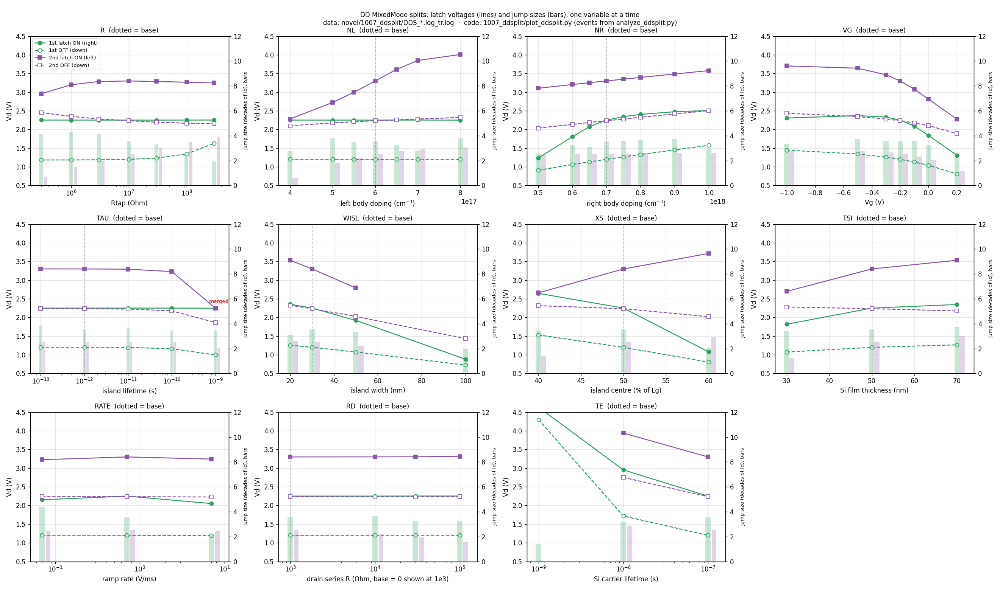
*변수별 두 래치의 ON/OFF 전압(선)과 점프 크기(막대). 데이터: `1007_ddsplit/DDS_*.log_tr.log` · 코드: `1007_ddsplit/plot_ddsplit.py`*

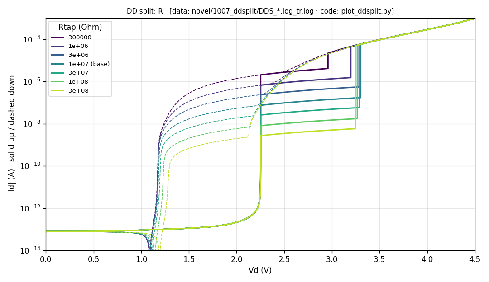
*Id-Vd (탭 저항). 실선 올라감, 점선 내려옴. 데이터: `1007_ddsplit/DDS_*.log_tr.log` · 코드: `plot_ddsplit.py`*


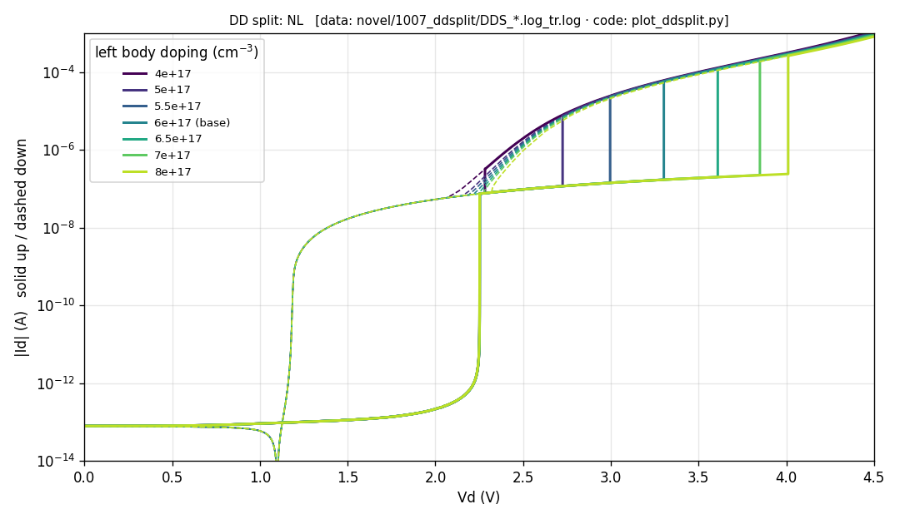
*Id-Vd (왼쪽 body 도핑). 실선 올라감, 점선 내려옴. 데이터: `1007_ddsplit/DDS_*.log_tr.log` · 코드: `plot_ddsplit.py`*


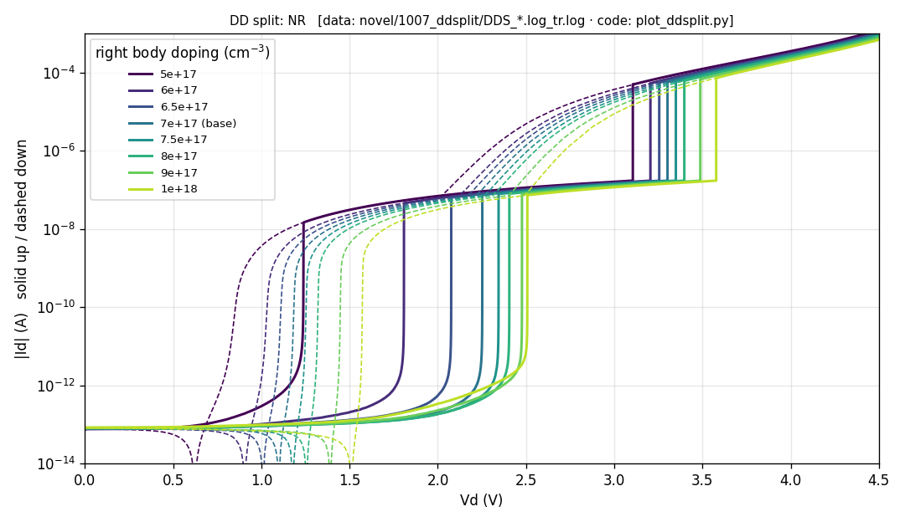
*Id-Vd (오른쪽 body 도핑). 실선 올라감, 점선 내려옴. 데이터: `1007_ddsplit/DDS_*.log_tr.log` · 코드: `plot_ddsplit.py`*


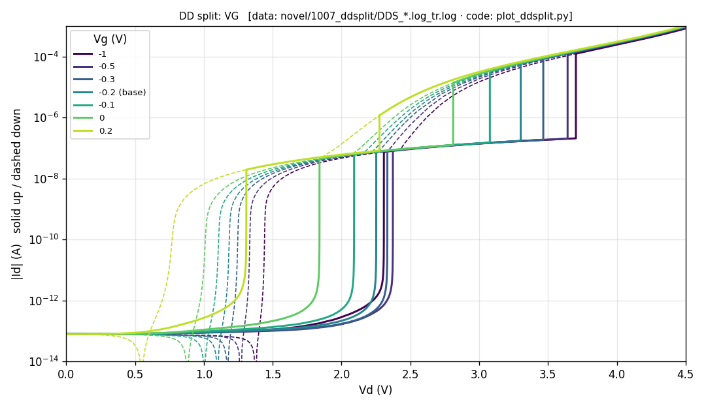
*Id-Vd (Vg). 실선 올라감, 점선 내려옴. 데이터: `1007_ddsplit/DDS_*.log_tr.log` · 코드: `plot_ddsplit.py`*


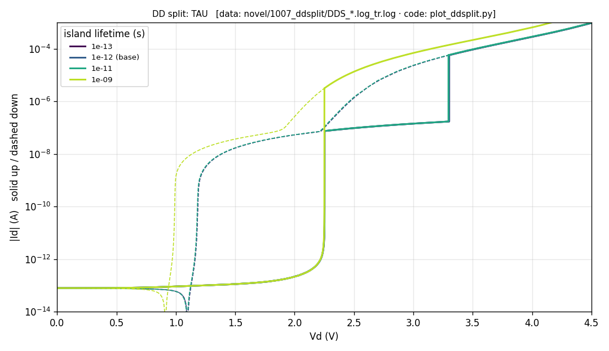
*Id-Vd (섬 lifetime). 실선 올라감, 점선 내려옴. 데이터: `1007_ddsplit/DDS_*.log_tr.log` · 코드: `plot_ddsplit.py`*


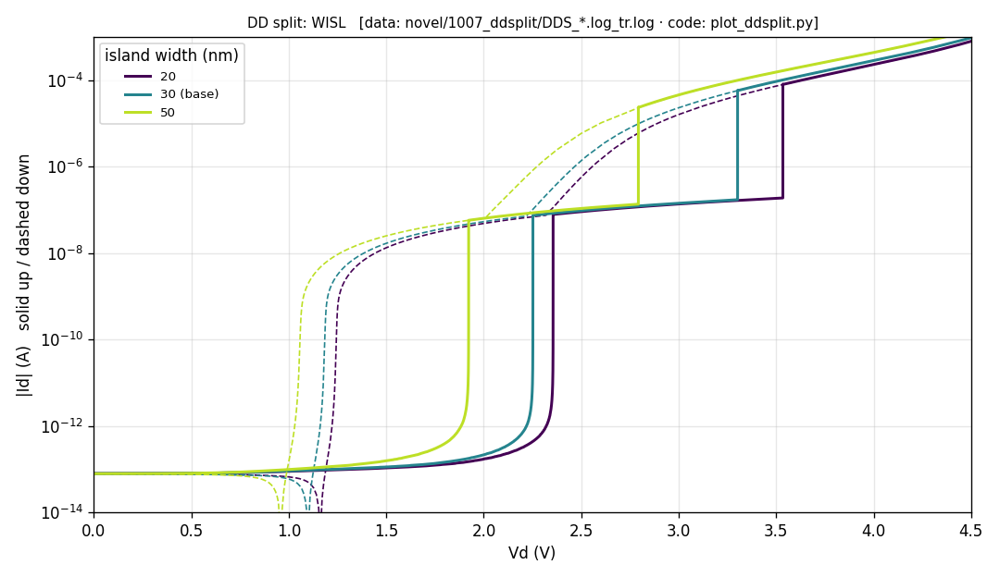
*Id-Vd (섬 폭). 실선 올라감, 점선 내려옴. 데이터: `1007_ddsplit/DDS_*.log_tr.log` · 코드: `plot_ddsplit.py`*

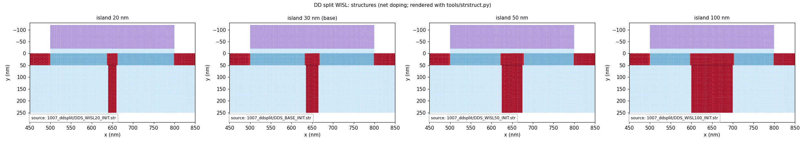
*구조 변경 (섬 폭). 출처: `1007_ddsplit/DDS_*_INIT.str` · 코드: `tools/strstruct.py` (via `plot_ddsplit.py`)*

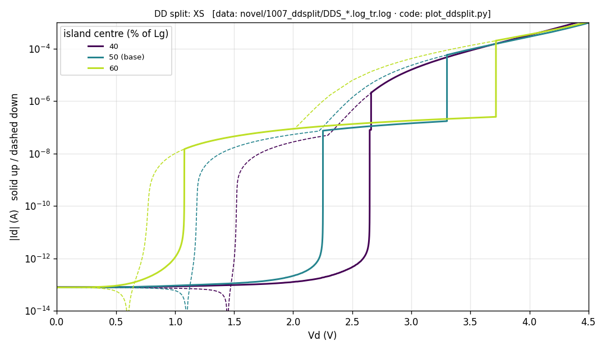
*Id-Vd (섬 위치). 실선 올라감, 점선 내려옴. 데이터: `1007_ddsplit/DDS_*.log_tr.log` · 코드: `plot_ddsplit.py`*

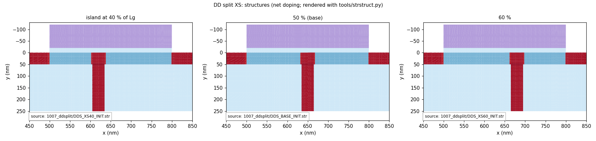
*구조 변경 (섬 위치). 출처: `1007_ddsplit/DDS_*_INIT.str` · 코드: `tools/strstruct.py` (via `plot_ddsplit.py`)*

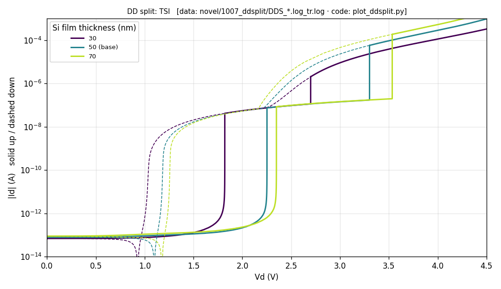
*Id-Vd (Si 두께). 실선 올라감, 점선 내려옴. 데이터: `1007_ddsplit/DDS_*.log_tr.log` · 코드: `plot_ddsplit.py`*

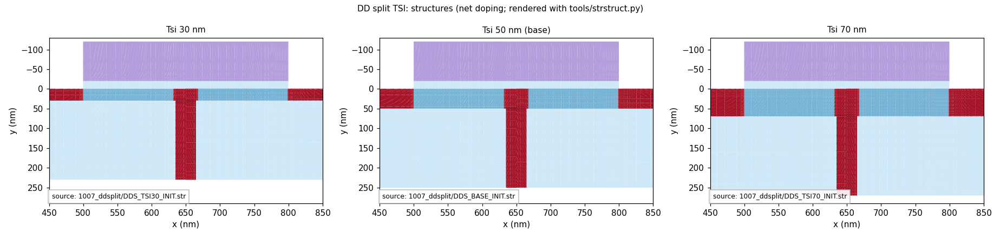
*구조 변경 (Si 두께). 출처: `1007_ddsplit/DDS_*_INIT.str` · 코드: `tools/strstruct.py` (via `plot_ddsplit.py`)*

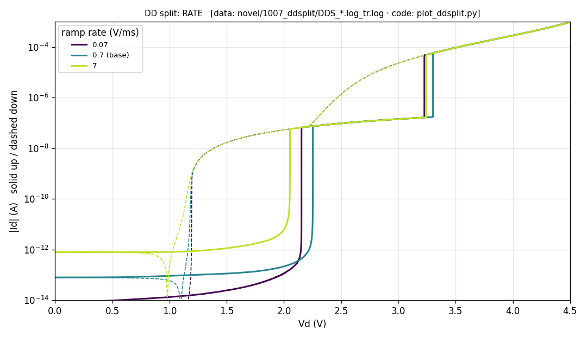
*Id-Vd (ramp 속도). 실선 올라감, 점선 내려옴. 데이터: `1007_ddsplit/DDS_*.log_tr.log` · 코드: `plot_ddsplit.py`*


### 래치 메커니즘 (.str 스냅샷)

각 split은 고정 Vd마다 `.str` 스냅샷(`DDS_*_T_tr_N`)을 저장한다. 채널(y = 25 nm)을 따라 전위와 정공 밀도를 읽고, STL마다 **source → body 전자 장벽**과 **body 평균 정공 밀도**를 계산했다 (`mech_ddsplit.py`).

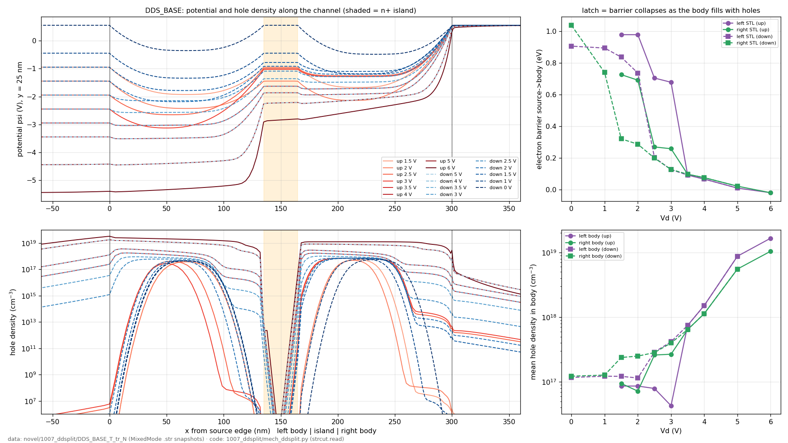
*데이터: `1007_ddsplit/DDS_BASE_T_tr_N` · 코드: `1007_ddsplit/mech_ddsplit.py`*

| 스냅샷 | Vd (V) | 왼쪽 장벽 (eV) | 왼쪽 body 정공 (cm⁻³) | 오른쪽 장벽 (eV) | 오른쪽 body 정공 (cm⁻³) |
|---|---|---|---|---|---|
| up | 1.50 | 0.979 | 8.619e+16 | 0.727 | 9.451e+16 |
| up | 2.00 | 0.979 | 8.619e+16 | 0.692 | 7.187e+16 |
| up | 2.50 | 0.705 | 7.909e+16 | 0.270 | 2.600e+17 |
| up | 3.00 | 0.679 | 4.283e+16 | 0.259 | 2.677e+17 |
| up | 3.50 | 0.092 | 7.469e+17 | 0.097 | 6.434e+17 |
| up | 4.00 | 0.067 | 1.517e+18 | 0.076 | 1.135e+18 |
| up | 5.00 | 0.010 | 8.763e+18 | 0.022 | 5.551e+18 |
| up | 6.00 | -0.019 | 1.664e+19 | -0.020 | 1.046e+19 |
| down | 5.00 | 0.010 | 8.763e+18 | 0.022 | 5.551e+18 |
| down | 4.00 | 0.067 | 1.517e+18 | 0.076 | 1.135e+18 |
| down | 3.50 | 0.092 | 7.469e+17 | 0.097 | 6.434e+17 |
| down | 3.00 | 0.126 | 4.176e+17 | 0.127 | 3.997e+17 |
| down | 2.50 | 0.203 | 2.883e+17 | 0.199 | 2.834e+17 |
| down | 2.00 | 0.737 | 1.147e+17 | 0.287 | 2.504e+17 |
| down | 1.50 | 0.838 | 1.219e+17 | 0.321 | 2.382e+17 |
| down | 1.00 | 0.895 | 1.223e+17 | 0.740 | 1.274e+17 |
| down | 0.00 | 0.907 | 1.172e+17 | 1.039 | 1.225e+17 |

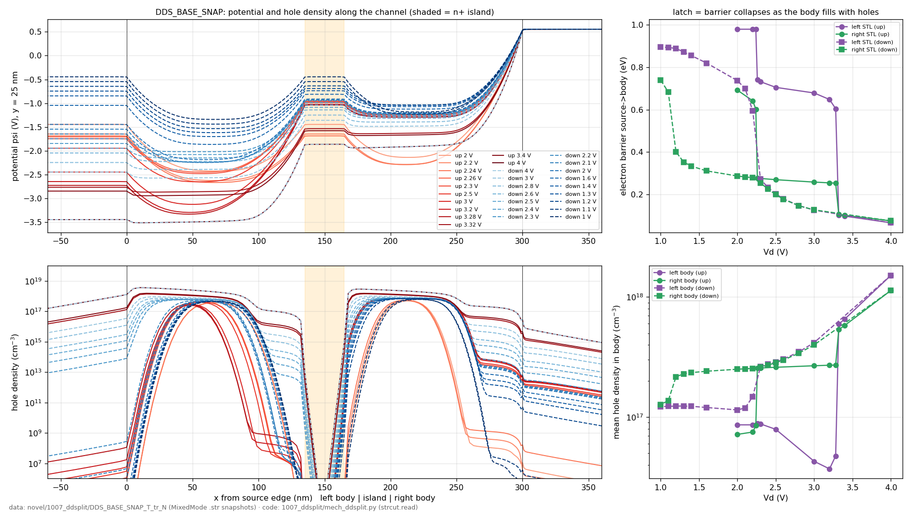
*데이터: `1007_ddsplit/DDS_BASE_SNAP_T_tr_N` · 코드: `1007_ddsplit/mech_ddsplit.py`*

| 스냅샷 | Vd (V) | 왼쪽 장벽 (eV) | 왼쪽 body 정공 (cm⁻³) | 오른쪽 장벽 (eV) | 오른쪽 body 정공 (cm⁻³) |
|---|---|---|---|---|---|
| up | 2.00 | 0.979 | 8.619e+16 | 0.692 | 7.179e+16 |
| up | 2.20 | 0.979 | 8.619e+16 | 0.642 | 7.510e+16 |
| up | 2.24 | 0.979 | 8.619e+16 | 0.603 | 8.486e+16 |
| up | 2.26 | 0.741 | 8.827e+16 | 0.277 | 2.556e+17 |
| up | 2.30 | 0.732 | 8.781e+16 | 0.276 | 2.564e+17 |
| up | 2.50 | 0.705 | 7.909e+16 | 0.270 | 2.600e+17 |
| up | 3.00 | 0.679 | 4.283e+16 | 0.259 | 2.677e+17 |
| up | 3.20 | 0.648 | 3.705e+16 | 0.255 | 2.704e+17 |
| up | 3.28 | 0.605 | 4.749e+16 | 0.254 | 2.714e+17 |
| up | 3.32 | 0.103 | 5.954e+17 | 0.106 | 5.367e+17 |
| up | 3.40 | 0.098 | 6.571e+17 | 0.102 | 5.809e+17 |
| up | 4.00 | 0.067 | 1.517e+18 | 0.076 | 1.135e+18 |
| down | 4.00 | 0.067 | 1.517e+18 | 0.076 | 1.135e+18 |
| down | 3.00 | 0.126 | 4.176e+17 | 0.127 | 3.997e+17 |
| down | 2.80 | 0.147 | 3.489e+17 | 0.147 | 3.405e+17 |
| down | 2.60 | 0.180 | 3.039e+17 | 0.178 | 2.986e+17 |
| down | 2.50 | 0.203 | 2.883e+17 | 0.199 | 2.834e+17 |
| down | 2.40 | 0.232 | 2.756e+17 | 0.225 | 2.715e+17 |
| down | 2.30 | 0.273 | 2.624e+17 | 0.254 | 2.617e+17 |
| down | 2.20 | 0.595 | 1.480e+17 | 0.279 | 2.545e+17 |
| down | 2.10 | 0.700 | 1.191e+17 | 0.283 | 2.525e+17 |
| down | 2.00 | 0.737 | 1.148e+17 | 0.287 | 2.504e+17 |
| down | 1.60 | 0.820 | 1.202e+17 | 0.311 | 2.411e+17 |
| down | 1.40 | 0.855 | 1.231e+17 | 0.334 | 2.347e+17 |
| down | 1.30 | 0.872 | 1.237e+17 | 0.353 | 2.296e+17 |
| down | 1.20 | 0.889 | 1.235e+17 | 0.401 | 2.163e+17 |
| down | 1.10 | 0.894 | 1.229e+17 | 0.683 | 1.371e+17 |
| down | 1.00 | 0.895 | 1.223e+17 | 0.740 | 1.274e+17 |

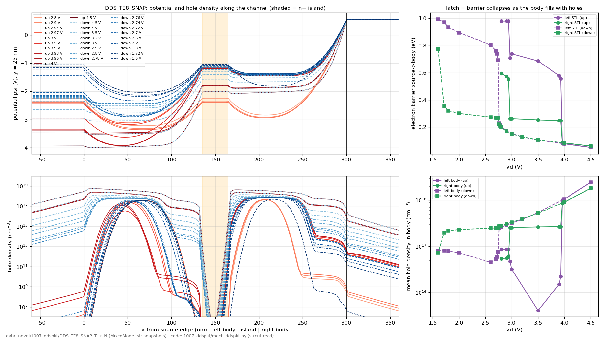
*데이터: `1007_ddsplit/DDS_TE8_SNAP_T_tr_N` · 코드: `1007_ddsplit/mech_ddsplit.py`*

| 스냅샷 | Vd (V) | 왼쪽 장벽 (eV) | 왼쪽 body 정공 (cm⁻³) | 오른쪽 장벽 (eV) | 오른쪽 body 정공 (cm⁻³) |
|---|---|---|---|---|---|
| up | 2.80 | 0.979 | 8.620e+16 | 0.596 | 5.402e+16 |
| up | 2.90 | 0.979 | 8.620e+16 | 0.572 | 5.599e+16 |
| up | 2.94 | 0.979 | 8.620e+16 | 0.554 | 5.971e+16 |
| up | 2.97 | 0.708 | 4.753e+16 | 0.264 | 2.555e+17 |
| up | 3.00 | 0.738 | 3.200e+16 | 0.263 | 2.560e+17 |
| up | 3.50 | 0.686 | 4.109e+15 | 0.254 | 2.636e+17 |
| up | 3.90 | 0.579 | 1.503e+16 | 0.248 | 2.684e+17 |
| up | 3.93 | 0.556 | 2.254e+16 | 0.247 | 2.687e+17 |
| up | 3.96 | 0.080 | 9.955e+17 | 0.085 | 8.602e+17 |
| up | 4.00 | 0.078 | 1.055e+18 | 0.083 | 9.016e+17 |
| up | 4.50 | 0.050 | 2.437e+18 | 0.061 | 1.818e+18 |
| down | 4.50 | 0.050 | 2.437e+18 | 0.061 | 1.818e+18 |
| down | 4.00 | 0.078 | 1.055e+18 | 0.083 | 9.016e+17 |
| down | 3.50 | 0.105 | 5.396e+17 | 0.107 | 5.261e+17 |
| down | 3.20 | 0.129 | 3.835e+17 | 0.128 | 3.954e+17 |
| down | 3.00 | 0.153 | 3.151e+17 | 0.151 | 3.320e+17 |
| down | 2.90 | 0.172 | 2.882e+17 | 0.168 | 3.061e+17 |
| down | 2.80 | 0.204 | 2.628e+17 | 0.197 | 2.824e+17 |
| down | 2.78 | 0.214 | 2.567e+17 | 0.206 | 2.773e+17 |
| down | 2.76 | 0.230 | 2.484e+17 | 0.219 | 2.709e+17 |
| down | 2.74 | 0.692 | 7.561e+16 | 0.269 | 2.512e+17 |
| down | 2.72 | 0.739 | 5.943e+16 | 0.270 | 2.508e+17 |
| down | 2.70 | 0.761 | 5.288e+16 | 0.270 | 2.504e+17 |
| down | 2.60 | 0.804 | 4.533e+16 | 0.273 | 2.482e+17 |
| down | 2.00 | 0.895 | 7.196e+16 | 0.300 | 2.305e+17 |
| down | 1.80 | 0.934 | 7.944e+16 | 0.321 | 2.189e+17 |
| down | 1.72 | 0.970 | 8.073e+16 | 0.354 | 2.005e+17 |
| down | 1.60 | 0.992 | 8.075e+16 | 0.773 | 7.280e+16 |

읽는 법: 오른쪽 STL은 첫 번째 래치에서 장벽이 약 0.7 → 0.27 eV로 떨어지고 body 정공이 늘어난다. 이때 섬 전위가 올라가 왼쪽 장벽도 일부 낮아진다 (0.98 → 0.70 eV). 두 번째 래치에서 왼쪽 장벽이 0.68 → 0.09 eV로 무너지며 왼쪽 body가 정공으로 찬다. 내려올 때 왼쪽 장벽은 0.13 → 0.20 → 0.74 eV로 **여러 스냅샷에 걸쳐 서서히** 회복된다. 이게 두 번째 래치가 완만하게 꺼지는 모습이다.

### 두 번째 래치를 급격히 끄기 위한 시도

내려올 때 왼쪽 STL이 약 0.26 V에 걸쳐 서서히 꺼진다 (기준 OFF 폭). 원인 가설: drain이 이상적인 전압원이라 켜진 가지를 끝까지 따라 내려오고, 접힘(fold)에서 튀어 내려올 계기가 없다. 그래서 (1) **drain 직렬 저항**(부하선을 기울여 접힘에서 점프하게), (2) **Si 수명 감소**(body 정공을 빨리 빼서 유지 전류↑)를 시험한다.

| 덱 | 바꾼 것 | 1번째 ON (V) | 점프 (dec) | 2번째 ON (V) | 점프 (dec) | 2번째 OFF (V) | 1번째 OFF (V) | OFF 폭 (V) | 판정 |
|---|---|---|---|---|---|---|---|---|---|
| `DDS_BASE` | base (same as the double-latch deck, 0-6-0 V sweep) | 2.251 | 3.5 | 3.300 | 2.5 | 2.24 | 1.20 | 0.264 | 래치 2번 |
| `DDS_RD1e4` | drain series resistor 1e4 Ohm (load line) | 2.251 | 3.6 | 3.302 | 2.2 | 2.23 | 1.20 | 0.269 | 래치 2번 |
| `DDS_RD1e5` | drain series resistor 1e5 Ohm (load line) | 2.252 | 3.2 | 3.317 | 1.6 | 2.24 | 1.20 | 0.368 | 래치 2번 |
| `DDS_RD3e4` | drain series resistor 3e4 Ohm (load line) | 2.252 | 3.2 | 3.305 | 1.9 | 2.23 | 1.20 | 0.356 | 래치 2번 |
| `DDS_RD3e4_TE1em8` | drain resistor 3e4 Ohm + Si lifetime 1e-8 s | 2.953 | 3.2 | 3.948 | 2.0 | 2.76 | 1.72 | 0.094 | 래치 2번 |
| `DDS_TE1em8` | Si carrier lifetime 1e-8 s (base 1e-7) | 2.953 | 3.2 | 3.940 | 2.9 | 2.75 | 1.72 | 0.044 | 래치 2번 |
| `DDS_TE1em9` | Si carrier lifetime 1e-9 s (base 1e-7) | 4.631 | 1.4 | – | – | – | 4.30 | – | 확인 필요 |

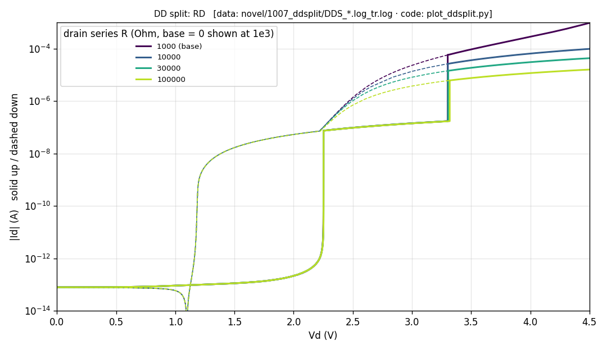
*Id-Vd (drain 직렬 저항). 데이터: `1007_ddsplit/DDS_RD*.log_tr.log` · 코드: `plot_ddsplit.py`*

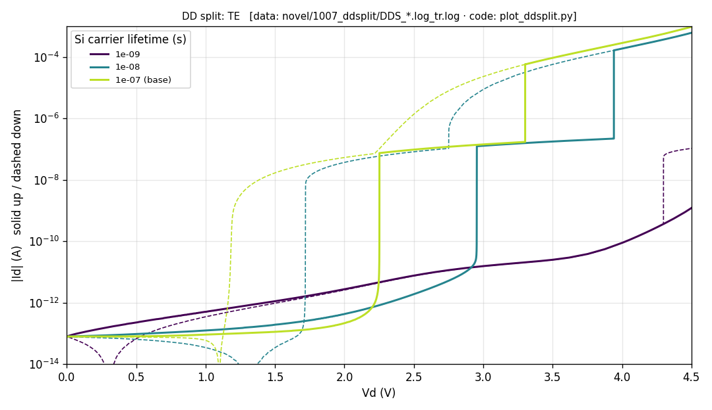
*Id-Vd (Si 수명). 데이터: `1007_ddsplit/DDS_TE*.log_tr.log` · 코드: `plot_ddsplit.py`*

### Si 수명 1e-8 s 기반 split (급격한 꺼짐 조건 위에서 다시 조절)

Si 수명 1e-8 s에서 두 번째 래치가 점프로 꺼졌다 (OFF 폭 0.26 → 0.04 V). 대신 두 래치가 모두 약 0.7 V 올라갔다. 이 조건을 유지한 채 도핑·R·Vg·섬 위치로 래치 전압을 다시 내리고, 꺼짐이 계속 급격한지 본다. `DDS_TE8_SNAP`은 꺼지는 구간의 촘촘한 스냅샷으로 메커니즘을 본다.

| 덱 | 바꾼 것 | 1번째 ON (V) | 점프 (dec) | 2번째 ON (V) | 점프 (dec) | 2번째 OFF (V) | 1번째 OFF (V) | OFF 폭 (V) | 판정 |
|---|---|---|---|---|---|---|---|---|---|
| `DDS_TE1em8` | Si carrier lifetime 1e-8 s (base 1e-7) | 2.953 | 3.2 | 3.940 | 2.9 | 2.75 | 1.72 | 0.044 | 래치 2번 |
| `DDS_TE2em8` | Si carrier lifetime 2e-8 s | 2.658 | 3.6 | 3.715 | 2.8 | 2.54 | 1.50 | 0.203 | 래치 2번 |
| `DDS_TE2em8_XS60` | Si lifetime 2e-8 s + island 60 % | 1.309 | 2.3 | 4.438 | 3.4 | 2.34 | 1.05 | 0.158 | 래치 2번 |
| `DDS_TE5em8` | Si carrier lifetime 5e-8 s | 2.396 | 3.8 | 3.478 | 2.6 | 2.34 | 1.30 | 0.300 | 래치 2번 |
| `DDS_TE5em9` | Si carrier lifetime 5e-9 s | 3.392 | 3.2 | 4.234 | 3.0 | 3.03 | 2.05 | 0.000 | 래치 2번 |
| `DDS_TE5em9_XS60` | Si lifetime 5e-9 s + island 60 % | 1.610 | 1.7 | 5.224 | 4.0 | 2.86 | 1.47 | 0.001 | 래치 2번 |
| `DDS_TE8_NL5e17` | Si lifetime 1e-8 s + left body 5e17 | 2.953 | 3.2 | 3.317 | 2.4 | 2.68 | 1.72 | 0.105 | 래치 2번 |
| `DDS_TE8_NL5p5e17` | Si lifetime 1e-8 s + left body 5.5e17 | 2.953 | 3.2 | 3.624 | 2.6 | 2.72 | 1.72 | 0.097 | 래치 2번 |
| `DDS_TE8_NL6p5e17` | Si lifetime 1e-8 s + left body 6.5e17 | 2.953 | 3.2 | 4.244 | 3.1 | 2.78 | 1.72 | 0.030 | 래치 2번 |
| `DDS_TE8_NR5e17` | Si lifetime 1e-8 s + right body 5e17 | 1.672 | 2.4 | 3.691 | 2.8 | 2.53 | 1.33 | 0.056 | 래치 2번 |
| `DDS_TE8_NR5e17_NL5e17` | Si lifetime 1e-8 s + right 5e17 + left 5e17 | 1.672 | 2.4 | 3.069 | 2.2 | 2.45 | 1.33 | 0.081 | 래치 2번 |
| `DDS_TE8_NR6e17` | Si lifetime 1e-8 s + right body 6e17 | 2.383 | 2.7 | 3.816 | 2.8 | 2.64 | 1.54 | 0.203 | 래치 2번 |
| `DDS_TE8_NR6e17_NL5p5e17` | Si lifetime 1e-8 s + right 6e17 + left 5.5e17 (pull both latches down) | 2.383 | 2.7 | 3.500 | 2.6 | 2.61 | 1.54 | 0.094 | 래치 2번 |
| `DDS_TE8_R3e6` | Si lifetime 1e-8 s + Rtap 3e6 | 2.952 | 3.8 | 3.952 | 2.4 | 2.77 | 1.61 | 0.047 | 래치 2번 |
| `DDS_TE8_R3e7` | Si lifetime 1e-8 s + Rtap 3e7 | 2.953 | 2.9 | 3.958 | 3.4 | 2.75 | 1.87 | 0.033 | 래치 2번 |
| `DDS_TE8_SNAP` | Si lifetime 1e-8 s with dense snapshots around the turn-off (mechanism) | 2.953 | 3.3 | 3.939 | 2.9 | 2.75 | 1.72 | 0.048 | 래치 2번 |
| `DDS_TE8_TAU1em11` | Si lifetime 1e-8 s + island lifetime 1e-11 s | 2.953 | 3.1 | 3.934 | 2.9 | 2.75 | 1.72 | 0.047 | 래치 2번 |
| `DDS_TE8_VG0` | Si lifetime 1e-8 s + Vg 0 V | 2.536 | 3.2 | 3.548 | 2.6 | 2.65 | 1.59 | 0.043 | 래치 2번 |
| `DDS_TE8_VG0_NL5p5e17` | Si lifetime 1e-8 s + Vg 0 V + left 5.5e17 | 2.536 | 3.2 | 3.218 | 2.3 | 2.60 | 1.59 | 0.062 | 래치 2번 |
| `DDS_TE8_VGm0p1` | Si lifetime 1e-8 s + Vg -0.1 V | 2.774 | 2.9 | 3.776 | 2.8 | 2.71 | 1.66 | 0.048 | 래치 2번 |
| `DDS_TE8_WISL50` | Si lifetime 1e-8 s + island 50 nm | 2.482 | 3.4 | 3.341 | 2.6 | 2.52 | 1.57 | 0.080 | 래치 2번 |
| `DDS_TE8_XS55` | Si lifetime 1e-8 s + island at 55 % of Lg | 2.216 | 3.2 | 4.440 | 3.3 | 2.68 | 1.49 | 0.075 | 래치 2번 |
| `DDS_TE8_XS60` | Si lifetime 1e-8 s + island at 60 % of Lg | 1.448 | 1.8 | 4.779 | 3.7 | 2.56 | 1.23 | 0.056 | 래치 2번 |
| `DDS_TE8_XS60_NL5e17` | lifetime 1e-8 s + island 60 % + left body 5e17 | 1.448 | 1.8 | 4.080 | 3.0 | 2.50 | 1.23 | 0.093 | 래치 2번 |
| `DDS_TE8_XS60_NL5p5e17` | lifetime 1e-8 s + island 60 % + left body 5.5e17 | 1.448 | 1.9 | 4.471 | 3.3 | 2.53 | 1.23 | 0.201 | 래치 2번 |
| `DDS_TE8_XS60_NL5p5e17_RD3e5` | lifetime 1e-8 s + island 60 % + left 5.5e17 + drain R 3e5 | 1.448 | 1.4 | 4.564 | 1.3 | 2.61 | 1.23 | 0.308 | 래치 2번 |
| `DDS_TE8_XS60_NR1e18` | lifetime 1e-8 s + island 60 % + right body 1e18 | 2.740 | 1.4 | 5.088 | 3.9 | 2.84 | 1.71 | 0.019 | 래치 2번 |
| `DDS_TE8_XS60_NR8e17` | lifetime 1e-8 s + island 60 % + right body 8e17 | 1.880 | 2.7 | 4.884 | 3.7 | 2.66 | 1.39 | 0.080 | 래치 2번 |
| `DDS_TE8_XS60_RD1e5` | lifetime 1e-8 s + island 60 % + drain series R 1e5 (flat top) | 1.448 | 1.7 | 4.812 | 1.7 | 2.60 | 1.23 | 0.115 | 래치 2번 |
| `DDS_TE8_XS60_RD1e6` | lifetime 1e-8 s + island 60 % + drain series R 1e6 (flat top) | 1.450 | 1.8 | 5.122 | 0.9 | 2.81 | 1.23 | 0.945 | 래치 2번 |
| `DDS_TE8_XS60_RD3e5` | lifetime 1e-8 s + island 60 % + drain series R 3e5 (flat top) | 1.448 | 1.4 | 4.883 | 1.3 | 2.66 | 1.23 | 0.344 | 래치 2번 |
| `DDS_TE8_XS60_SNAP` | Si lifetime 1e-8 s + island 60 % with dense snapshots around both loops (mechanism of the two-rectangle device) | 1.448 | 2.2 | 4.780 | 3.7 | 2.56 | 1.23 | 0.035 | 래치 2번 |
| `DDS_TE8_XS60_VG0` | lifetime 1e-8 s + island 60 % + Vg 0 V | 1.164 | 1.5 | 4.370 | 3.2 | 2.47 | 1.09 | 0.085 | 래치 2번 |
| `DDS_TE8_XS60_VGm0p1` | lifetime 1e-8 s + island 60 % + Vg -0.1 V | 1.316 | 1.9 | 4.621 | 3.5 | 2.52 | 1.17 | 0.067 | 래치 2번 |
| `DDS_TE8_XS65` | Si lifetime 1e-8 s + island at 65 % of Lg | – | – | 4.929 | 3.8 | 2.43 | 0.88 | 0.067 | 확인 필요 |
| `DDS_TE8_XS65_NL5e17_RD3e5` | lifetime 1e-8 s + island 65 % + left 5e17 + drain R 3e5 | – | – | 4.463 | 1.3 | 2.44 | 0.88 | 0.328 | 확인 필요 |
| `DDS_TE8_XS70` | Si lifetime 1e-8 s + island at 70 % of Lg | – | – | 4.920 | 3.8 | 2.26 | 0.40 | 0.054 | 확인 필요 |

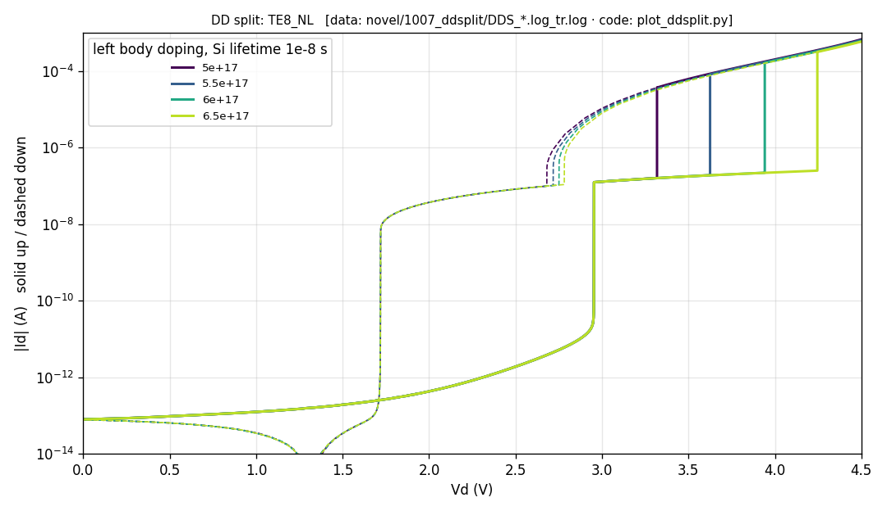
*Id-Vd (수명 1e-8 s + 왼쪽 도핑). 데이터: `1007_ddsplit/DDS_TE8_NL*.log_tr.log` · 코드: `plot_ddsplit.py`*

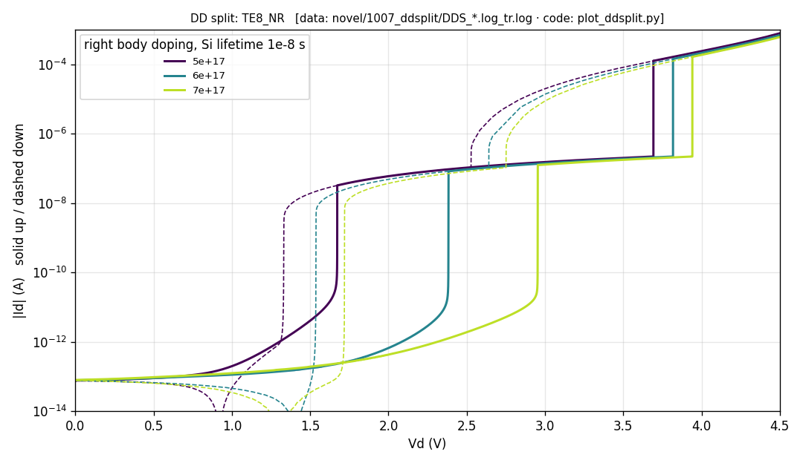
*Id-Vd (수명 1e-8 s + 오른쪽 도핑). 데이터: `1007_ddsplit/DDS_TE8_NR*.log_tr.log` · 코드: `plot_ddsplit.py`*

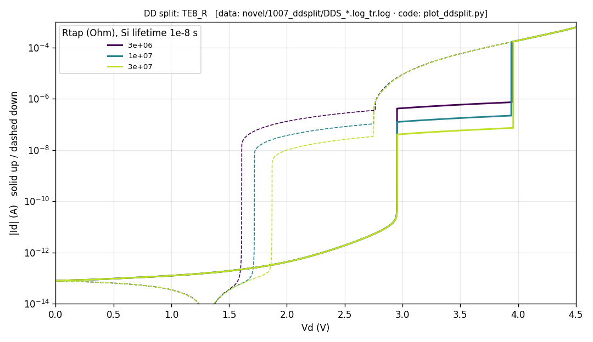
*Id-Vd (수명 1e-8 s + 탭 저항). 데이터: `1007_ddsplit/DDS_TE8_R*.log_tr.log` · 코드: `plot_ddsplit.py`*

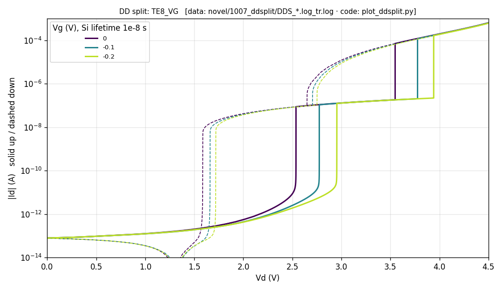
*Id-Vd (수명 1e-8 s + Vg). 데이터: `1007_ddsplit/DDS_TE8_VG*.log_tr.log` · 코드: `plot_ddsplit.py`*

### 두 개의 분리된 급격한 사각형 루프 (`TE8_XS60` 기반)

목표: 래치 두 개가 **각각 급격히 켜지고 꺼지며**, 두 히스테리시스 루프가 **겹치지 않고**(간격 > 0), 각 상태의 전류가 **평평한** 사각형. 기준은 Si 수명 1e-8 s + 섬 위치 Lg 60 % (`DDS_TE8_XS60`). 섬 위치, 왼쪽/오른쪽 도핑, Vg, Si 수명, drain 직렬 저항(윗변 평탄화)을 바꿨다.

| 덱 | 바꾼 것 | 루프 1 폭 (V) | 루프 2 폭 (V) | 루프 간격 (V) | 2번째 OFF 폭 (V) | 1번째 OFF 폭 (V) | 상태 II 기울기 (dec) | 상태 III 기울기 (dec) |
|---|---|---|---|---|---|---|---|---|
| `DDS_TE1em8` | Si carrier lifetime 1e-8 s (base 1e-7) | 1.233 | 1.189 | -0.201 | 0.044 | 0.010 | 0.24 | 2.18 |
| `DDS_TE2em8_XS60` | Si lifetime 2e-8 s + island 60 % | 0.260 | 2.096 | 1.033 | 0.158 | 0.078 | 1.08 | 3.10 |
| `DDS_TE5em9_XS60` | Si lifetime 5e-9 s + island 60 % | 0.142 | 2.369 | 1.246 | 0.001 | 0.008 | 1.11 | 3.02 |
| `DDS_TE8_XS55` | Si lifetime 1e-8 s + island at 55 % of Lg | 0.725 | 1.763 | 0.462 | 0.075 | 0.018 | 0.57 | 2.66 |
| `DDS_TE8_XS60` | Si lifetime 1e-8 s + island at 60 % of Lg | 0.221 | 2.214 | 1.117 | 0.056 | 0.032 | 1.06 | 3.08 |
| `DDS_TE8_XS60_NL5e17` | lifetime 1e-8 s + island 60 % + left body 5e17 | 0.221 | 1.585 | 1.047 | 0.093 | 0.032 | 0.97 | 2.55 |
| `DDS_TE8_XS60_NL5p5e17` | lifetime 1e-8 s + island 60 % + left body 5.5e17 | 0.221 | 1.940 | 1.083 | 0.201 | 0.033 | 1.02 | 2.81 |
| `DDS_TE8_XS60_NL5p5e17_RD3e5` | lifetime 1e-8 s + island 60 % + left 5.5e17 + drain R 3e5 | 0.219 | 1.949 | 1.167 | 0.308 | 0.035 | 1.03 | 1.19 |
| `DDS_TE8_XS60_NR1e18` | lifetime 1e-8 s + island 60 % + right body 1e18 | 1.029 | 2.251 | 0.097 | 0.019 | 0.001 | 0.46 | 3.03 |
| `DDS_TE8_XS60_NR8e17` | lifetime 1e-8 s + island 60 % + right body 8e17 | 0.489 | 2.226 | 0.778 | 0.080 | 0.018 | 0.77 | 2.80 |
| `DDS_TE8_XS60_RD1e5` | lifetime 1e-8 s + island 60 % + drain series R 1e5 (flat top) | 0.220 | 2.212 | 1.153 | 0.115 | 0.035 | 1.07 | 1.52 |
| `DDS_TE8_XS60_RD1e6` | lifetime 1e-8 s + island 60 % + drain series R 1e6 (flat top) | 0.218 | 2.310 | 1.362 | 0.945 | 0.036 | 1.09 | 0.93 |
| `DDS_TE8_XS60_RD3e5` | lifetime 1e-8 s + island 60 % + drain series R 3e5 (flat top) | 0.219 | 2.226 | 1.209 | 0.344 | 0.034 | 1.08 | 1.16 |
| `DDS_TE8_XS60_SNAP` | Si lifetime 1e-8 s + island 60 % with dense snapshots around both loops (mechanism of the two-rectangle device) | 0.221 | 2.216 | 1.117 | 0.035 | 0.034 | 1.06 | 3.04 |
| `DDS_TE8_XS60_VG0` | lifetime 1e-8 s + island 60 % + Vg 0 V | 0.073 | 1.900 | 1.307 | 0.085 | 0.068 | 1.38 | 2.71 |
| `DDS_TE8_XS60_VGm0p1` | lifetime 1e-8 s + island 60 % + Vg -0.1 V | 0.147 | 2.098 | 1.207 | 0.067 | 0.044 | 1.19 | 2.91 |
| `DDS_TE8_XS65` | Si lifetime 1e-8 s + island at 65 % of Lg | nan | 2.496 | nan | 0.067 | 0.184 | nan | 3.10 |
| `DDS_TE8_XS65_NL5e17_RD3e5` | lifetime 1e-8 s + island 65 % + left 5e17 + drain R 3e5 | nan | 2.025 | nan | 0.328 | 0.186 | nan | 1.16 |
| `DDS_TE8_XS70` | Si lifetime 1e-8 s + island at 70 % of Lg | nan | 2.664 | nan | 0.054 | 0.405 | nan | 3.48 |
| `DDS_XS60` | island centre at 60 % of Lg (left body longer) | 0.274 | 1.693 | 0.943 | 0.291 | 0.228 | 1.19 | 3.03 |

루프 간격 > 0이면 두 루프가 겹치지 않음. OFF 폭이 0에 가까울수록 급격히 꺼짐. 기울기(dec)는 그 상태에서 |Id|가 변하는 자릿수 (작을수록 평평한 윗변).

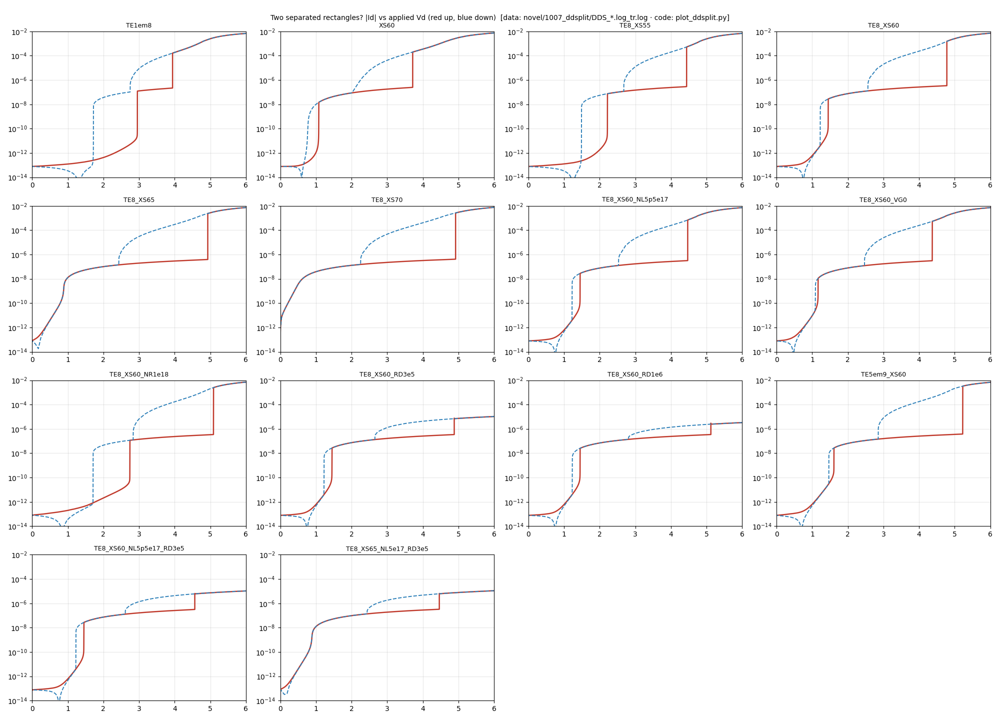
*분리된 사각형 루프 비교 (실선 올라감, 점선 내려옴). 데이터: `1007_ddsplit/DDS_TE8_XS*.log_tr.log` 등 · 코드: `1007_ddsplit/plot_ddsplit.py`*

<!-- DDSPLIT-AUTO-END -->

---

## Step 13. 왜 래치가 일어나나: .str로 원인 규명 (10/09)

🎯 **왜** Step 12에서 래치 두 번, 급격한 꺼짐, 분리된 두 루프를 얻었다. 각 래치가 **무엇 때문에 켜지고 꺼지는지** `.str` 물리량으로 설명하려고 한다.

🛠 **어떻게**
- 래치 전후에 스냅샷을 촘촘히 저장한 run 3개를 분석했다: `DDS_BASE_SNAP`(기준), `DDS_TE8_SNAP`(Si 수명 1e-8 s), `DDS_TE8_XS60_SNAP`(분리된 두 사각형 소자).
- 스냅샷마다, STL마다 다음을 계산했다 (Si 삼각형 면적 적분, 폭 0.5 µm):

| 양 | `.str` 필드 | 의미 |
|---|---|---|
| 장벽 | 전위 `100` | source → body 전자 장벽 (`mech_ddsplit.py`) |
| body 정공 | `107` | 기생 BJT의 base 전하 |
| 최대 전계 | `103` | drain 쪽 접합 전계 |
| I_ii | impact 생성률 `105` | impact ionization으로 생기는 정공 전류 (body로 들어감) |
| 재결합 | 재결합률 `118` | body 안 / 그 STL의 n+ source(왼쪽 = n+ source, 오른쪽 = n+ 섬) 안에서 사라지는 정공 |
| M-1 | I_ii / I_e | 전자 1개당 생기는 정공 수 (I_e는 log의 전류) |

### 해석 (기준 소자 `DDS_BASE_SNAP` 숫자)

**1번째 래치 = 오른쪽 STL의 기생 BJT 되먹임.**
2.24 V에서 오른쪽 drain 접합 전계가 1.16e6 V/cm, M-1 ≈ 0.25다. impact 정공이 오른쪽 body에 쌓여 body–섬(오른쪽 STL의 source) 접합이 순방향이 된다. 그러면 섬에서 전자가 더 들어오고, impact 정공이 더 생기는 양의 되먹임이 걸린다. **2.24 → 2.26 V 사이(20 mV)**에 I_ii가 5e-13 → 9e-9 A로 4자리 뛰고, 장벽은 0.60 → 0.28 eV로 무너진다.
켜진 뒤에는 정공 수지가 맞는다. 예를 들어 3.0 V에서 I_ii 1.96e-8 A ≈ body 재결합 1.06e-8 A + 섬 재결합 1.00e-8 A다. 생긴 정공의 절반은 body에서, 절반은 lifetime을 줄인 섬에서 사라진다.

**2번째 래치 = 섬 전위가 왼쪽 STL의 drain 전압이 되어 같은 되먹임이 왼쪽에서 일어남.**
오른쪽이 켜진 뒤 섬 전위가 오르면서 왼쪽 STL의 drain 쪽(섬 왼쪽 가장자리) 전계가 3.6e5 → 7.1e5 V/cm(2.2 → 3.28 V)로 커진다. 그에 따라 왼쪽 I_ii가 1e-20 → 4e-13 A로 늘어난다. **3.28 → 3.32 V**에서 왼쪽 장벽이 0.61 → 0.10 eV로 무너지고 I_ii가 4e-13 → 3.4e-6 A로 뛴다.
오른쪽에서 생긴 정공은 섬(수명 1e-12 s)에서 재결합하므로 왼쪽 body로 넘어가지 않는다. 그래서 왼쪽은 **자기 전계로만** 켜진다. 이것이 두 래치가 분리되는 이유다 (Step 6).

**꺼짐 = 재결합이 impact 정공을 이기는 순간.**
내려오면 전계와 M-1이 줄어든다. 켜진 상태는 impact 정공이 재결합을 이기고 남은 정공으로 body를 순방향으로 유지하는 동안만 버틴다.
- Si 수명 1e-7 s: 왼쪽은 2.3 V까지 켜져 있다 (유지 전류 약 1e-7 A). 그 시점에도 생긴 정공의 29 %만 재결합으로 잃어서 여유가 많다. 그래서 켜진 전류가 3.0 → 2.3 V에서 2.3e-5 → 1e-7 A로 **천천히 줄어들다가** 꺼진다 = 완만해 보이는 꺼짐.
- Si 수명 1e-8 s: 2.76 V에서 이미 생긴 정공의 78 %를 재결합으로 잃는다. 여유가 없어서 **큰 전류(유지 전류 약 5.5e-7 A)에서 한 번에 붕괴**한다 (2.76 → 2.74 V에서 6자리).
- 즉 **Si 수명은 유지 전류를 올리는 손잡이**다. 대가로 켜는 데도 더 많은 정공이 필요해 두 래치 전압이 함께 오른다 (Step 12).

### 측정값 (자동 생성)

<!-- STEP13-AUTO-START -->

*(자동 생성: 2026-10-10 08:11 · 코드 `1007_ddsplit/mech_ddsplit.py`, `mech2_ddsplit.py`, `update_readme_step13.py`)*

### 기준 (Si 수명 1e-7 s, 섬 50 %): `DDS_BASE_SNAP`


*채널(y = 25 nm)의 전위·정공 분포와 STL별 장벽, body 정공. 데이터: `1007_ddsplit/DDS_BASE_SNAP_T_tr_N` (.str), `DDS_BASE_SNAP.log_tr.log` · 코드: `1007_ddsplit/mech_ddsplit.py`*

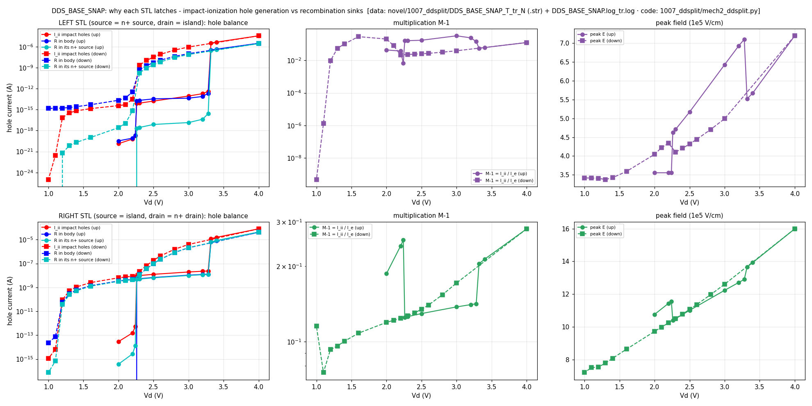
*STL별 정공 수지: impact ionization 생성 vs 재결합 (body, 각 STL의 n+ source), 증배 M-1, 최대 전계. 데이터: `1007_ddsplit/DDS_BASE_SNAP_T_tr_N` (.str), `DDS_BASE_SNAP.log_tr.log` · 코드: `1007_ddsplit/mech2_ddsplit.py`*

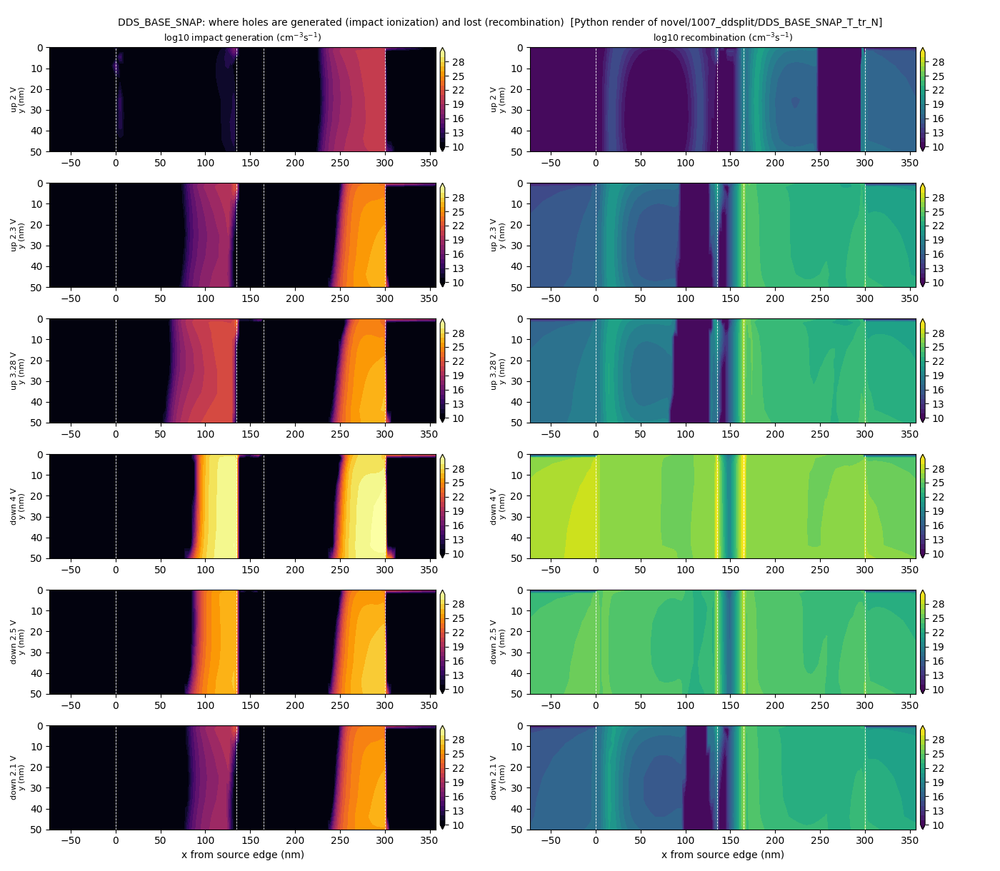
*정공이 생기는 곳(impact ionization)과 사라지는 곳(재결합)의 2D 지도. 데이터: `1007_ddsplit/DDS_BASE_SNAP_T_tr_N` (.str), `DDS_BASE_SNAP.log_tr.log` · 코드: `1007_ddsplit/mech2_ddsplit.py`*

| 래치 | 스냅샷 (Vd) | 장벽 (eV) | body 정공 (cm⁻³) | 최대 전계 (V/cm) | impact 정공 전류 I_ii (A) | body 재결합 (A) | n+ source 재결합 (A) | 전자 전류 I_e (A) | M-1 |
|---|---|---|---|---|---|---|---|---|---|
| 오른쪽 ON | up 2.24 V | 0.603 | 8.49e+16 | 1.16e+06 | 5.25e-13 | -1.29e-12 | 1.30e-14 | 2.06e-12 | 0.254 |
| 오른쪽 ON | up 2.26 V | 0.277 | 2.56e+17 | 1.04e+06 | 9.39e-09 | 5.11e-09 | 4.81e-09 | 7.51e-08 | 0.125 |
| 오른쪽 OFF | down 1.2 V | 0.401 | 2.16e+17 | 7.54e+05 | 9.29e-11 | 5.82e-11 | 3.88e-11 | 9.99e-10 | 0.093 |
| 오른쪽 OFF | down 1.1 V | 0.683 | 1.37e+17 | 7.51e+05 | 6.54e-15 | 7.46e-14 | 6.90e-16 | 8.68e-14 | 0.075 |
| 왼쪽 ON | up 3.28 V | 0.605 | 4.75e+16 | 7.10e+05 | 4.19e-13 | 2.13e-13 | 2.72e-16 | 2.89e-12 | 0.145 |
| 왼쪽 ON | up 3.32 V | 0.103 | 5.95e+17 | 5.52e+05 | 3.38e-06 | 3.38e-07 | 2.83e-07 | 6.01e-05 | 0.056 |
| 왼쪽 OFF | down 2.3 V | 0.273 | 2.62e+17 | 4.10e+05 | 2.35e-09 | 5.06e-10 | 1.84e-10 | 1.01e-07 | 0.023 |
| 왼쪽 OFF | down 2.2 V | 0.595 | 1.48e+17 | 4.34e+05 | 3.20e-14 | 3.61e-13 | 6.77e-16 | 1.49e-12 | 0.022 |

왼쪽 STL이 켜져 있는 마지막 스냅샷(2.3 V): 전자 전류 1.01e-07 A (= 유지 전류), impact 정공 2.35e-09 A 중 **29 %가 재결합**으로 사라짐 → 나머지만 body를 순방향으로 유지하는 base 전류가 된다.

### Si 수명 1e-8 s (급격한 꺼짐): `DDS_TE8_SNAP`


*채널(y = 25 nm)의 전위·정공 분포와 STL별 장벽, body 정공. 데이터: `1007_ddsplit/DDS_TE8_SNAP_T_tr_N` (.str), `DDS_TE8_SNAP.log_tr.log` · 코드: `1007_ddsplit/mech_ddsplit.py`*

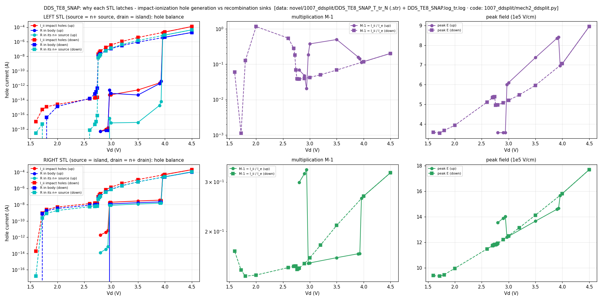
*STL별 정공 수지: impact ionization 생성 vs 재결합 (body, 각 STL의 n+ source), 증배 M-1, 최대 전계. 데이터: `1007_ddsplit/DDS_TE8_SNAP_T_tr_N` (.str), `DDS_TE8_SNAP.log_tr.log` · 코드: `1007_ddsplit/mech2_ddsplit.py`*

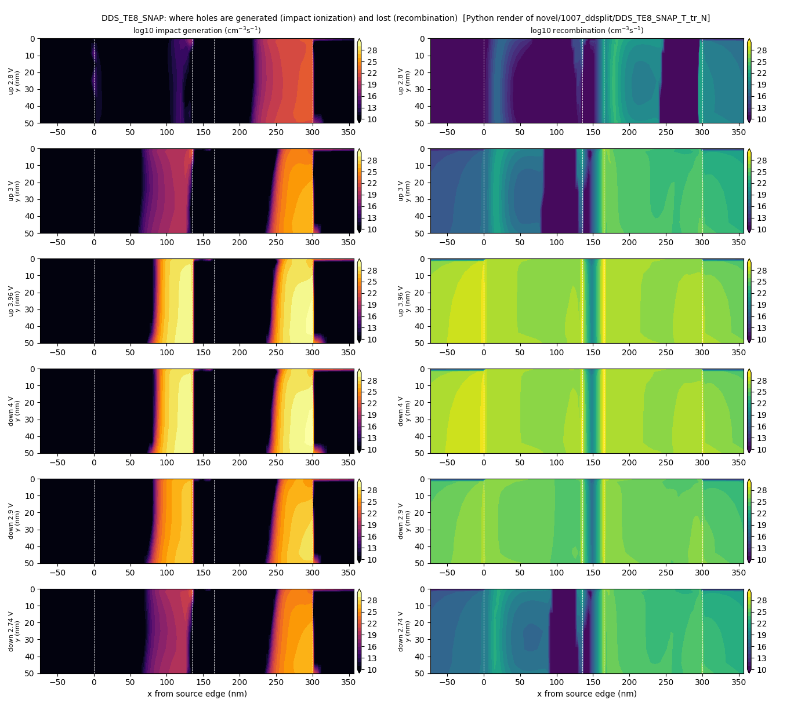
*정공이 생기는 곳(impact ionization)과 사라지는 곳(재결합)의 2D 지도. 데이터: `1007_ddsplit/DDS_TE8_SNAP_T_tr_N` (.str), `DDS_TE8_SNAP.log_tr.log` · 코드: `1007_ddsplit/mech2_ddsplit.py`*

| 래치 | 스냅샷 (Vd) | 장벽 (eV) | body 정공 (cm⁻³) | 최대 전계 (V/cm) | impact 정공 전류 I_ii (A) | body 재결합 (A) | n+ source 재결합 (A) | 전자 전류 I_e (A) | M-1 |
|---|---|---|---|---|---|---|---|---|---|
| 오른쪽 ON | up 2.94 V | 0.554 | 5.97e+16 | 1.40e+06 | 6.73e-12 | -3.79e-11 | 7.02e-14 | 2.03e-11 | 0.332 |
| 오른쪽 ON | up 2.97 V | 0.264 | 2.56e+17 | 1.24e+06 | 1.94e-08 | 1.22e-08 | 8.20e-09 | 1.26e-07 | 0.154 |
| 오른쪽 OFF | down 1.72 V | 0.354 | 2.00e+17 | 9.35e+05 | 9.44e-10 | 7.52e-10 | 2.41e-10 | 6.48e-09 | 0.146 |
| 오른쪽 OFF | down 1.6 V | 0.773 | 7.28e+16 | 9.40e+05 | 2.03e-14 | -1.90e-16 | 1.65e-17 | 1.20e-13 | 0.170 |
| 왼쪽 ON | up 3.93 V | 0.556 | 2.25e+16 | 8.42e+05 | 3.96e-12 | 3.79e-12 | 6.27e-15 | 2.74e-11 | 0.145 |
| 왼쪽 ON | up 3.96 V | 0.080 | 9.96e+17 | 6.95e+05 | 1.95e-05 | 3.76e-06 | 7.37e-06 | 1.72e-04 | 0.113 |
| 왼쪽 OFF | down 2.76 V | 0.230 | 2.48e+17 | 4.96e+05 | 2.13e-08 | 1.04e-08 | 6.15e-09 | 5.52e-07 | 0.039 |
| 왼쪽 OFF | down 2.74 V | 0.692 | 7.56e+16 | 5.38e+05 | 2.38e-14 | 4.16e-13 | 7.71e-17 | 3.44e-13 | 0.069 |

왼쪽 STL이 켜져 있는 마지막 스냅샷(2.76 V): 전자 전류 5.52e-07 A (= 유지 전류), impact 정공 2.13e-08 A 중 **78 %가 재결합**으로 사라짐 → 나머지만 body를 순방향으로 유지하는 base 전류가 된다.

### Si 수명 1e-8 s + 섬 60 % (분리된 두 사각형): `DDS_TE8_XS60_SNAP`

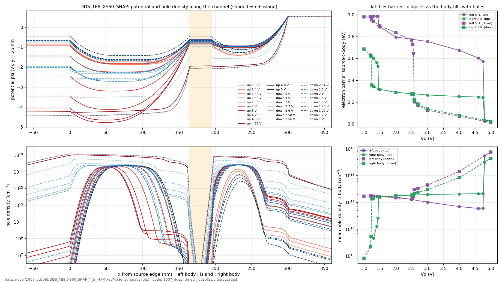
*채널(y = 25 nm)의 전위·정공 분포와 STL별 장벽, body 정공. 데이터: `1007_ddsplit/DDS_TE8_XS60_SNAP_T_tr_N` (.str), `DDS_TE8_XS60_SNAP.log_tr.log` · 코드: `1007_ddsplit/mech_ddsplit.py`*

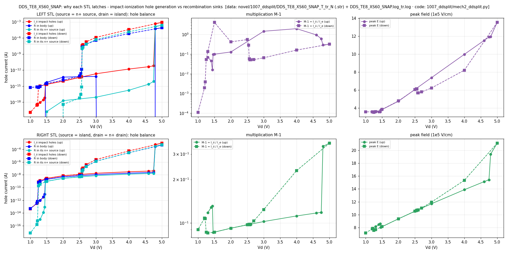
*STL별 정공 수지: impact ionization 생성 vs 재결합 (body, 각 STL의 n+ source), 증배 M-1, 최대 전계. 데이터: `1007_ddsplit/DDS_TE8_XS60_SNAP_T_tr_N` (.str), `DDS_TE8_XS60_SNAP.log_tr.log` · 코드: `1007_ddsplit/mech2_ddsplit.py`*

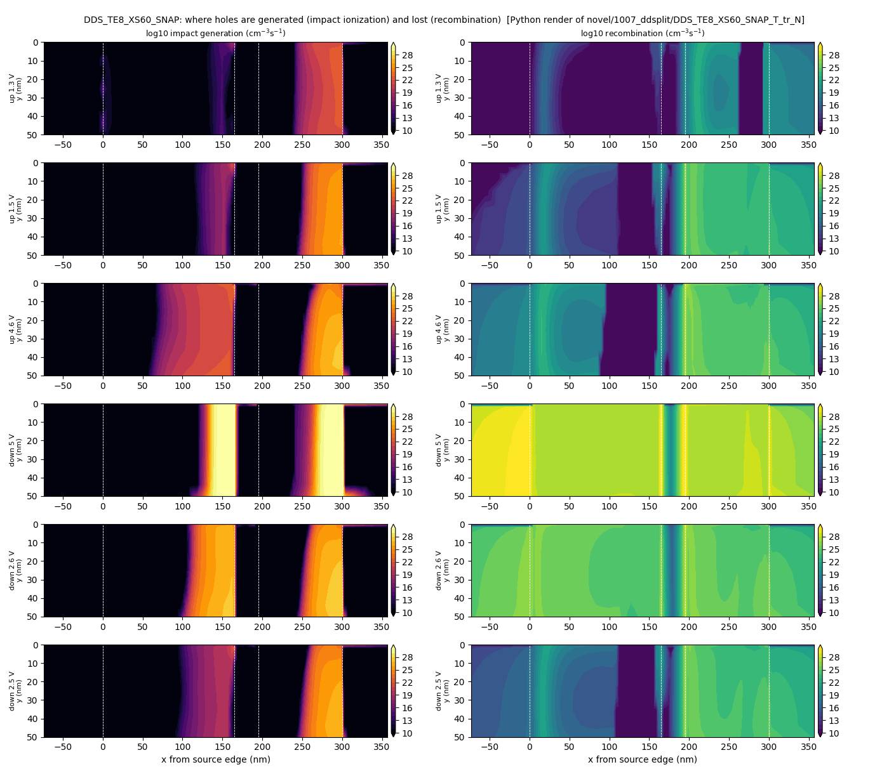
*정공이 생기는 곳(impact ionization)과 사라지는 곳(재결합)의 2D 지도. 데이터: `1007_ddsplit/DDS_TE8_XS60_SNAP_T_tr_N` (.str), `DDS_TE8_XS60_SNAP.log_tr.log` · 코드: `1007_ddsplit/mech2_ddsplit.py`*

| 래치 | 스냅샷 (Vd) | 장벽 (eV) | body 정공 (cm⁻³) | 최대 전계 (V/cm) | impact 정공 전류 I_ii (A) | body 재결합 (A) | n+ source 재결합 (A) | 전자 전류 I_e (A) | M-1 |
|---|---|---|---|---|---|---|---|---|---|
| 오른쪽 ON | up 1.44 V | 0.527 | 2.58e+16 | 8.58e+05 | 8.93e-12 | 9.11e-12 | 8.90e-14 | 6.82e-11 | 0.131 |
| 오른쪽 ON | up 1.46 V | 0.320 | 1.57e+17 | 8.04e+05 | 2.46e-09 | 1.78e-09 | 8.29e-10 | 2.86e-08 | 0.086 |
| 오른쪽 ON | up 4.75 V | 0.245 | 2.11e+17 | 1.54e+06 | 4.02e-08 | 2.33e-08 | 1.71e-08 | 3.39e-07 | 0.118 |
| 오른쪽 ON | up 4.8 V | 0.039 | 3.16e+18 | 1.94e+06 | 5.52e-04 | 2.81e-04 | 3.07e-04 | 1.63e-03 | 0.339 |
| 오른쪽 OFF | down 1.25 V | 0.357 | 1.35e+17 | 7.56e+05 | 7.89e-10 | 6.37e-10 | 1.94e-10 | 9.15e-09 | 0.086 |
| 오른쪽 OFF | down 1.22 V | 0.619 | 5.32e+15 | 7.87e+05 | 4.53e-13 | 7.05e-13 | 5.88e-16 | 4.23e-12 | 0.107 |
| 왼쪽 ON | up 4.75 V | 0.574 | 6.09e+16 | 1.19e+06 | 6.33e-12 | -1.98e-11 | 7.64e-15 | 1.04e-11 | 0.607 |
| 왼쪽 ON | up 4.8 V | 0.026 | 5.49e+18 | 1.19e+06 | 4.76e-04 | 5.14e-05 | 1.49e-04 | 1.63e-03 | 0.292 |
| 왼쪽 OFF | down 2.58 V | 0.215 | 2.96e+17 | 5.70e+05 | 3.48e-08 | 1.63e-08 | 1.10e-08 | 6.73e-07 | 0.052 |
| 왼쪽 OFF | down 2.56 V | 0.645 | 1.62e+17 | 6.13e+05 | 6.10e-14 | 1.40e-12 | 6.80e-16 | 1.06e-12 | 0.058 |

왼쪽 STL이 켜져 있는 마지막 스냅샷(2.58 V): 전자 전류 6.73e-07 A (= 유지 전류), impact 정공 3.48e-08 A 중 **78 %가 재결합**으로 사라짐 → 나머지만 body를 순방향으로 유지하는 base 전류가 된다.

<!-- STEP13-AUTO-END -->

---

## 최종 결과

**1. 소자 하나로 "직렬 두 STL"이 동작한다 (DD).**
SOI body를 n+ 섬으로 나누고(Step 3), 섬을 1e7 Ω으로 접지하고(Step 5, 10), 섬 lifetime을 1e-12 s로 줄여 가로 PNP 결합을 끊고(Step 6), 왼쪽 body를 래치 가능한 최저 도핑 6e17로 올렸다(Step 9). 그 결과 Id-Vd에 **래치가 두 번** 나왔다.

| | 1번째 래치 (오른쪽 STL) | 2번째 래치 (왼쪽 STL) |
|---|---|---|
| 켜짐 (up) | 2.254 V | 3.296 V |
| 꺼짐 (down) | 약 1.2 V | 3.0 → 2.2 V |
| 전류 변화 | 1e-12 → 7e-8 A | 2e-7 → 1e-4 A |
| 근거 | DD 단독 7e17 V_LU 2.235 V와 일치 | 점프 순간 섬 전압 1.72 V ≈ DD 단독 6e17 V_LU 1.778 V |

(그림 0, 데이터 `1001/tap/MM_TAPT_ISL_W30LK_L6_R7_R1e7_UD75S_MF_DD_VGm0p2.log_tr.log`)

**2. 이 결과가 나오기까지 필요했던 조건**
- body를 **물리적으로** 나눠야 한다. 도핑·두께·gate만 나누면 Efp가 이어져서 래치가 한 번뿐이다 (Step 1–4).
- 섬에 **전류가 빠져나갈 길(탭 + R)**이 있어야 한다. 떠 있는 섬은 직렬 제약 때문에 둘이 함께 켜진다 (Step 3, 5).
- 섬을 건너는 **정공을 섬 안에서 없애야** 한다 (lifetime 감소). 섬 폭 100 nm나 윗면 contact로는 부족했다 (Step 6).
- 왼쪽 STL 자체가 **급격히 래치하는 도핑**이어야 한다 (hcte 기준 6e17 이상, Step 9).
- R은 섬 전위를 올리기에 충분히 커야 하지만, 클수록 첫 번째 점프는 작아진다 (Step 10).

**3. 아직 확정하지 못한 것**
- 더 현실적인 hcte 모델에서는 오른쪽 drain 접합의 전자 온도 폭주 때문에 12가지 시도 모두 3.6–5.3 V에서 멈춰서, **두 번째 래치를 확인하지 못했다** (Step 11). 첫 번째 래치까지는 hcte와 DD 모두 같은 모양이다.
- DD 결과의 래치 전압은 실제보다 낮게 나온 값이다 (hcte 대비 0.7–0.8 V).
- (해결) Step 10의 첫 DD run은 소자 폭이 1 µm로 계산됐다. 0.5 µm로 다시 돌려도 래치 전압은 6 mV 이내로 같았다 (Step 12).

---

## 트레이드오프 요약

| 조절 변수 | 올리면 좋아지는 것 | 올리면 나빠지는 것 | 현재 선택 |
|---|---|---|---|
| 탭 저항 R | 섬 전위가 적은 전류로 오름, 오른쪽 STL 전압이 안전 구간에 머묾 | 첫 번째 래치 점프가 작아짐, R → ∞이면 직렬 제약 복귀 | 1e7 Ω |
| 섬 폭 | 가로 PNP 결합 약화 | 오른쪽 body 짧아져 V_LU ↓, 결합은 여전 | 30 nm |
| 섬 lifetime ↓ | 정공이 섬에서 재결합 → 분리 | 공정 구현 필요, 래치 창 0.70 → 0.06 V | 1e-12 s |
| 왼쪽 body 도핑 | 급격한 래치 (장벽 ↑) | V_LU ↑ → 필요한 섬 전위 ↑ | 6e17 |
| 물리 모델 hcte | 정확한 impact / 래치 전압 | 고전압 전자 온도 폭주, 매우 느림 | 확인 중 (DD로 먼저) |
| ramp 속도 | 계산 시간 ↓ | V_LU 왜곡 (7 V/ms에서 +0.1 V) | 0.7 V/ms |
| drain 접합 격자 | 래치 전압 정확도 (2 %) | 계산량 ↑, 폭주는 해결 못 함 | 1 nm (MF) |

---

## 현재 상태와 다음 단계

- **완료**: DD split 1–4차 69개 (Step 12 자동 블록). 급격한 꺼짐 = Si 수명 1e-8 s. 두 루프가 분리되고 둘 다 급격한 소자 = `DDS_TE8_XS60` (루프 1: 1.23–1.45 V, 루프 2: 2.56–4.78 V, 간격 1.12 V).
- **실행 중**: 5차 16개, **"두 개의 분리된 급격한 사각형"**을 목표로 `TE8_XS60`을 다듬는다 (섬 위치, 도핑, Vg, 수명, 평평한 윗변용 drain 저항). `1007_ddsplit/queue_ddsplit5.sh`, CPU 2개. 끝나면 `finalize_ddsplit3.sh`가 분석 → README → commit/push.

---

## 부록: 핵심 데이터 파일

저장소에 올린 log (그 외 raw 데이터는 서버 `/home/ysseo/novel/` 같은 경로):

| Step | 파일 |
|---|---|
| 1 | `0921/STL_NB5p0_localfine.log`, `0921/SPLIT_L5p0_R5p2_X50.log`, `0921/B10_W20_L5p0_R5p2.log` |
| 2 | `0927/BIG_{L3_R7,L7_R3,L8_R2}_X50.log` |
| 3 | `0928/ISL_W30_L3_R7.log`, `0928/idvg_return/IDVGR_BIG_L3_R7_X50_vd1.log` |
| 4 | `0929/splitgate/SG_G2D_m0p2.log` |
| 5 | `1001/tap/TAPT_ISL_W30_L3_R7_{R3e5,R3e4}_VGm0p2.log`, `…_R1e4_UP_VGm0p2.log` |
| 6 | `1001/tap/TAPT_ISL_{W100,W30TC}_L3_R7_R1e4_UD6S_VGm0p2.log`, `TAPT_ISL_W30LK_L3_R7_R1e4_UD6S_VGm0p2_extract.dat` |
| 7 | `1001/tap/TAPT_ISL_W30LK_L3_R7_R3e5_UD7S_VGm0p2_extract.dat`, `…_R1e6_UD7S_VGm0p2.log` |
| 8 | `…_R1e6_RS50_NEWT_VGm0p2.log`, `…_R1e6_UD7S_MF_VGm0p2.log`, `…_L6_R7_R1e6_UD75S_MF_VGm0p2.log` |
| 9 | `1001/tap/LEFTONLY_L135_P*_{UD6S,UD3,UD3_R7,DD_UP4}_VGm0p2.log` |
| 10 | `1001/tap/MM_TAPT_ISL_W30LK_L6_R7_R1e7_UD75S_MF_DD_VGm0p2.log_tr.log` |
| 11 | `1001/tap/MM_TAPT_ISL_W30LK_L6_R7_R1e7_UD75S_MF_HC_VGm0p2.log_tr.log` |
| 12 | `1001/tap/MM_TAPT_ISL_W30LK_L6_R7_R1e7_UD75S_MF_DD_W05_VGm0p2.log_tr.log` (split 결과는 완료 후 추가) |

`*_extract.dat` 열: `time_s Vd_V Id_A Is_A Itap_A Vtap_internal_V VB_left_V VB_right_V V_island_V` (원본의 20행마다 1행 + |Id| 변화가 큰 행 전부).

---

## 논문용 그림 (Fig. 1, Fig. 2)

논문 첫 그림(요약·원리)과 등가회로. 그림마다 PNG(미리보기), **PDF(벡터, 글자 유지)**, SVG(벡터), HTML(원본)을 같이 올렸다.

### Fig. 1. 소자 개념과 동작 원리

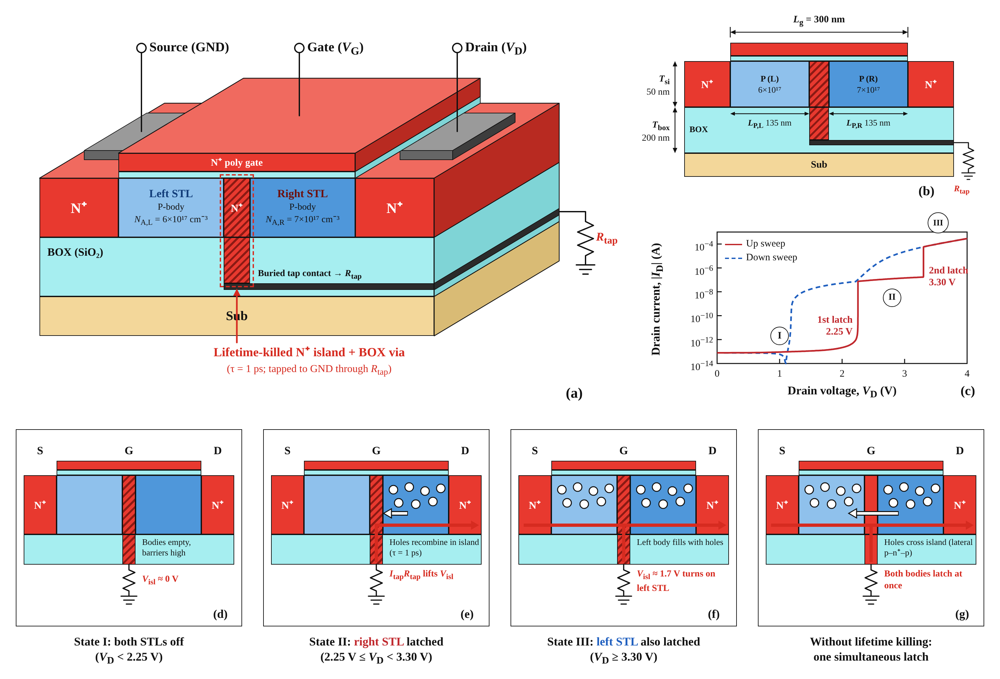

파일: [PDF](docs/fig/paper/fig1_concept.pdf) · [SVG](docs/fig/paper/fig1_concept.svg) · [PNG](docs/fig/paper/fig1_concept.png) · [HTML 원본](docs/fig/paper/fig1_concept.html)
(c) 데이터: `1001/tap/MM_TAPT_ISL_W30LK_L6_R7_R1e7_UD75S_MF_DD_W05_VGm0p2.log_tr.log` (DD, MixedMode, W = 0.5 µm, 0–4 V 구간) · 구조 치수: 덱 `1001/tap/TAPT_ISL_W30LK_L6_R7_R1e7_UD75S_MF_VGm0p2.in`

> **캡션 초안.** Fig. 1. (a) Schematic of the divided-body SOI STL: an N⁺ island splits the p-body into a left and a right STL in series; the island and its BOX via are lifetime-killed (τ = 1 ps) and tapped to ground through R<sub>tap</sub>. (b) Cross-section with dimensions. (c) Simulated I<sub>D</sub>–V<sub>D</sub> (drift-diffusion, V<sub>G</sub> = −0.2 V, 0.7 V/ms) showing two latch events with hysteresis. (d)–(f) Carrier states I–III marked in (c). (g) Without lifetime killing, holes cross the island and both STLs latch at once.

### Fig. 2. 등가회로

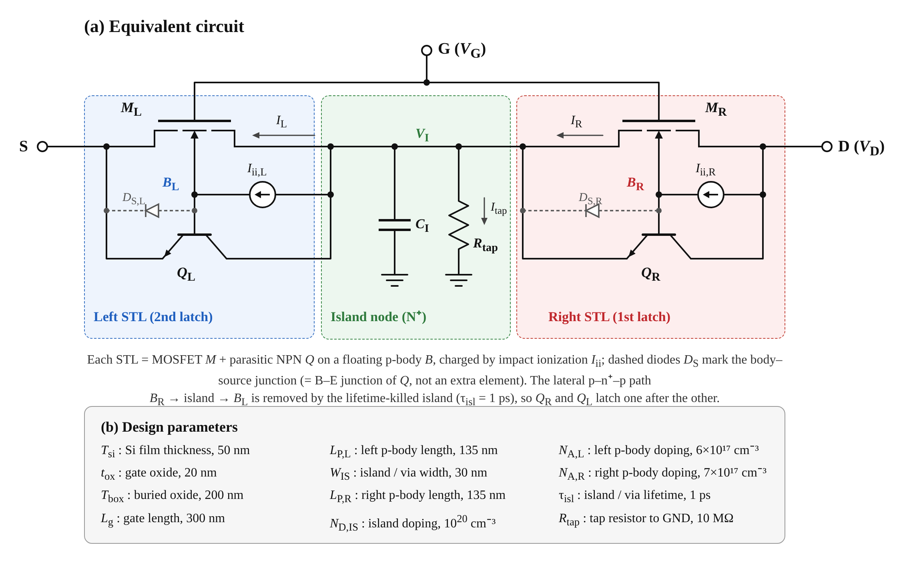

파일: [PDF](docs/fig/paper/fig2_equivalent_circuit.pdf) · [SVG](docs/fig/paper/fig2_equivalent_circuit.svg) · [PNG](docs/fig/paper/fig2_equivalent_circuit.png) · [HTML 원본](docs/fig/paper/fig2_equivalent_circuit.html)

각 STL = MOSFET(M) + 기생 NPN(Q) + floating body(B) + impact ionization 전류원(I<sub>ii</sub>). 점선 다이오드 D<sub>S</sub>는 별도 소자가 아니라 Q의 B–E 접합(body–source)을 표시한 것이다. 두 STL은 섬 노드 V<sub>I</sub>에서 직렬로 이어지고, 섬은 C<sub>I</sub>와 R<sub>tap</sub>으로 접지된다.

### 그림 고치는 법
- **README 안에서는 그림을 직접 편집할 수 없다** (GitHub README는 정적 이미지만 보여 준다). 고친 뒤 파일을 다시 올려야 한다.
- **PDF**: Illustrator나 Inkscape에서 열면 도형·글자가 각각 편집된다 (글자가 텍스트로 남아 있음). 논문 투고용 벡터 그림으로 그대로 써도 된다.
- **SVG**: PowerPoint에 삽입 → 그룹 해제(도형으로 변환)하면 도형 단위로 편집된다. 글자는 윤곽선으로 바뀌어 있어 다시 입력해야 한다.
- **HTML 원본**: 원래 편집 캔버스에서 내보낸 것. HTML을 고친 뒤 `python3 docs/fig/paper/render.py`를 돌리면 PNG·PDF·SVG가 다시 만들어진다 (playwright + chromium 필요, SVG는 poppler `pdftocairo`).
- 글꼴은 Times 계열(Tinos / Liberation Serif)이다.

---

## 연구 메모: 논문에서 논의할 점 (2026-10-08)

> 아이디어(내 생각)와, 그걸 이 저장소 데이터로 확인한 숫자를 같이 적는다. 숫자는 모두 up sweep 기준. 계산은 일회성 스크립트(`tools/plog.py`로 읽음).

### 1. State II가 I보다 III에 더 가깝다 (log 축에서)

**아이디어.** Fig. 1(c)에서 II는 I보다 III에 더 가깝게 놓여 있다. log 축으로 읽는 응용(다중 레벨 읽기 등)에서 장점이 될 수 있다.

**확인 (DD, 기준 소자 `DDS_BASE`).** 1번째 래치 점프 4.5 dec(I → II), 2번째 래치 점프 2.6 dec(II → III). 맞다. II는 III 쪽으로 치우쳐 있다.

**왜 그런가.** State II 전류는 탭 저항이 정한다. II 구간 전체에서 **I<sub>D</sub> = V<sub>isl</sub>/R<sub>tap</sub>** 이 그대로 맞는다 (V<sub>isl</sub> 0.77 → 1.69 V, I<sub>D</sub> 7.7e-8 → 1.7e-7 A, R = 1e7 Ω). 그래서 **II의 높이는 R<sub>tap</sub>으로 옮길 수 있다.** 반면 I(꺼짐 누설)과 III(양쪽 켜짐)는 R<sub>tap</sub>에 거의 안 변한다.

| R<sub>tap</sub> (Ω) | I → II 점프 (dec) | II → III 점프 (dec) | II 위치 |
|---|---|---|---|
| 3e5 | 5.9 | 0.8 | III에 거의 붙음 |
| 1e6 | 5.4 | 1.5 | III 쪽 |
| 1e7 (기준) | 4.5 | 2.6 | III 쪽 |
| 1e8 | 3.5 | 3.5 | **정확히 가운데** |
| 3e8 | 3.0 | 4.0 | I 쪽 |

데이터: `1007_ddsplit/DDS_{R3e5,R1e6,BASE,R1e8,R3e8}.log_tr.log`

**논의할 때 주의.** 세 레벨을 읽어서 구분하는 용도라면 log 간격이 고른 게(R ≈ 1e8 Ω) 오히려 유리하다. 가장 좁은 간격이 읽기 여유를 정하기 때문이다. "III에 가까운 게 유리하다"는 주장은 어떤 응용 기준인지 같이 정해야 한다. 어느 쪽이든 **R<sub>tap</sub> 하나로 II 위치를 고를 수 있다**는 것이 더 강한 주장이다.

### 2. State II가 매우 평평하다 → 다른 이중 래치 소자와 비교할 거리

**아이디어.** II 구간이 평평하다. 이중 래치가 일어나는 다른 소자와 비교해 우월성을 논의할 수 있을 것 같다.

**확인 (DD).** II 구간 기울기 0.33–0.42 dec/V. III 구간(약 1.0 dec/V)의 1/3 수준이다. 기준 소자에서는 II 구간 약 1 V 동안 전류가 2.2배만 변한다. R<sub>tap</sub> 3e5–3e8 Ω 전 범위에서 비슷하다.

**왜 그런가.** 위와 같은 이유다. II 전류가 V<sub>isl</sub>/R<sub>tap</sub>, 즉 저항 부하로 제한된다. 1번째 래치 순간 V<sub>isl</sub>이 이미 약 0.77 V까지 뛰어 있어서, 그 뒤로 V<sub>isl</sub>이 선형으로 조금 더 올라도 log로는 거의 평평하다.

**주의: hcte에서는 평평하지 않았다.** 같은 소자의 hcte run(`1001/tap/MM_TAPT_ISL_W30LK_L6_R7_R1e7_UD75S_MF_HC_VGm0p2.log_tr.log`, 4.42 V에서 중단)에서도 II 구간은 I<sub>D</sub> = V<sub>isl</sub>/R<sub>tap</sub>을 정확히 따른다. 하지만 1번째 래치 점프가 작아서(1.2 dec) 래치 직후 V<sub>isl</sub>이 약 0.02 V밖에 안 된다. 그래서 II 기울기가 **1.15 dec/V**로 가파르다(2.95–4.4 V 동안 1.7e-9 → 7.3e-8 A).
→ 평평함은 "1번째 래치에서 섬 전위가 얼마나 크게 뛰느냐"에 달려 있고, 이는 모델(DD/hcte)에 따라 다르다. **논문에서 평평함을 장점으로 내세우려면 이 조건을 같이 밝혀야 한다.** 예를 들어 R<sub>tap</sub>을 낮춰 1번째 점프를 키우거나 V<sub>G</sub>를 조정하는 식이다.

### 할 일
- [ ] 다른 이중 래치 / 다중 레벨 floating-body 소자 문헌 찾기 (II 구간 평평함, 레벨 간격, 레벨 위치 조절 방법 비교).
- [ ] 3레벨 읽기 응용이라면 목표 간격 정하기 → R<sub>tap</sub> 설계 기준 (DD에서 1e8 Ω이면 등간격).
- [ ] hcte에서 1번째 점프를 키우는 조건(R<sub>tap</sub>↓, V<sub>G</sub>) 찾아서 II 평평함이 유지되는지 확인.
